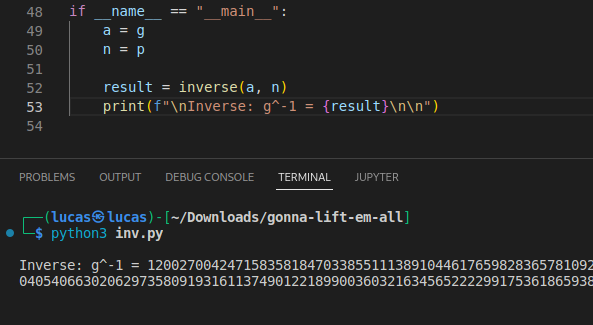

# Gonna-Lift-Em-All
Esse write-up será sobre sobre o desafio Gonna-Lift-Em-All do CTF Hack The Boo feito pelo Hack the Box para o Halloween.

## Sobre

Nesse desafio havia um arquivo zip para ser baixado, contendo um programa em python e um arquivo de texto. O programa é um utilizado para gerar as chaves pública e privada de criptografia e criptografar um mensagem, como pode ser visto no código-fonte abaixo.

```python
from Crypto.Util.number import bytes_to_long, getPrime
import random

FLAG = b'HTB{??????????????????????????????????????????????????????????????????????}'

def gen_params():
  p = getPrime(1024)
  g = random.randint(2, p-2)
  x = random.randint(2, p-2)
  h = pow(g, x, p)
  return (p, g, h), x

def encrypt(pubkey):
  p, g, h = pubkey
  m = bytes_to_long(FLAG)
  y = random.randint(2, p-2)
  s = pow(h, y, p)
  return (g * y % p, m * s % p)

def main():
  pubkey, privkey = gen_params()
  c1, c2 = encrypt(pubkey)

  with open('data.txt', 'w') as f:
    f.write(f'p = {pubkey[0]}\ng = {pubkey[1]}\nh = {pubkey[2]}\n(c1, c2) = ({c1}, {c2})\n')


if __name__ == "__main__":
  main()
```

Para gerar as chaves nessa criptografia é utilizado um número primo p e dois números aleatórios entre 2 e p-2, por fim é calculado um valor h a partir dos números anteriores.

Para criptografar as mensagens é utilizado a chave publica, composta pelo p, g e h, e mais um número aleatório y, com esses números o s é calculado. A partir do g, y e p é calculado o c1, e para o c2 é utilizado s, p e a mensagem convertida em long.

O arquivo de texto que veio junto no zip contém a chave pública e os dois valores, c1 e c2, resultantes da criptografia.

```
p = 163096280281091423983210248406915712517889481034858950909290409636473708049935881617682030048346215988640991054059665720267702269812372029514413149200077540372286640767440712609200928109053348791072129620291461211782445376287196340880230151621619967077864403170491990385250500736122995129377670743204192511487
g = 90013867415033815546788865683138787340981114779795027049849106735163065530238112558925433950669257882773719245540328122774485318132233380232659378189294454934415433502907419484904868579770055146403383222584313613545633012035801235443658074554570316320175379613006002500159040573384221472749392328180810282909
h = 36126929766421201592898598390796462047092189488294899467611358820068759559145016809953567417997852926385712060056759236355651329519671229503584054092862591820977252929713375230785797177168714290835111838057125364932429350418633983021165325131930984126892231131770259051468531005183584452954169653119524751729
(c1, c2) = (159888401067473505158228981260048538206997685715926404215585294103028971525122709370069002987651820789915955483297339998284909198539884370216675928669717336010990834572641551913464452325312178797916891874885912285079465823124506696494765212303264868663818171793272450116611177713890102083844049242593904824396, 119922107693874734193003422004373653093552019951764644568950336416836757753914623024010126542723403161511430245803749782677240741425557896253881748212849840746908130439957915793292025688133503007044034712413879714604088691748282035315237472061427142978538459398404960344186573668737856258157623070654311038584)
```


## Resolução

A flag que queremos descobrir está definida no código como sendo m e é utilizada apenas para gerar o valor c2, pela fórmula: c2 = m * s (mod p). Como já possuimos o c2 e o p, primeiro será necessário obter o s para então ser possível descobrir a mensagem m. Como s é um número obtido através de um calculo, precisa-se de todos os números que foram utilizados para ser possível calculá-lo novamente. E não possuímos o y utlizado, porém este pode ser obtido utilizando o c1. 

Pelo código: c1 = g * y (mod p). Como o y é o único elemento que não sabemos o valor nessa formula podemos isolá-lo. Mas como estamos utilizando matemática modular há várias regras diferentes da matemática "normal". Primeiro, não é possível apenas passar o p para o outro lado pois não se sabe por qual valor a multiplicação foi dividida para que o resto coubesse em p. Além disso, também não é possível passar o g para o outro lado dividindo, precisa-se encontrar um valor que quando multiplicado e calculado mod p resultará em algo equivalente a divisão por g, esse valor é chamado de inverso de g ou g<sup>-1</sup>. Dessa forma:

c1 = g * y (mod p) -> (c1 * g<sup>-1</sup>) % p = y % p. 

E como y já é um valor menor que p então não muda nada calcular o módulo dele, assim terminamos com: (c1 * g<sup>-1</sup>) % p = y.

Para calcular os inversos que serão necessários foi utilizado o código [extended_euclid.py](https://github.com/justinmorrow/modular-inverse/blob/master/extended_euclid.py) encontrado no repositório modular-inverse no github do Justin Morrow. Para obter os inversos basta definir a variável n do código como o nosso p e a variável a como o número do qual se deseja obter o inverso.


<br>**Imagem 01 - Obtenção do inverso de g** 
<br>
```
g^-1 = 120027004247158358184703385511138910446176598283657810928960020555251889532032199706156913358525135228299658796007082082987316875751452608872617761586138905964991747541264336966530405406630206297358091931611374901221899003603216345652222991753618659380928999922962044386202238694636990131574221328099007640482
```

Agora com o g<sup>-1</sup>, basta multiplicá-lo pelo c1 e fazer o módulo de p para obter o y. Dessa forma y = (c1 * g<sup>-1</sup>) % p. que resulta em:

```
y = 151545036818752418931716093171030939827729309717327611184964755063685533596024474465903219353892430936128129116061427826165388249908655823309049171719865481058072839169911183783187254412879190149192386989186799988830028288993778261809217410313001568877314905167838867719115514855795015291428405597461040625720
```

Agora, seguindo a fórmula que está no código para obter s. 

```
s = pow(h, y, p)
s = 97462626764574972789405707853736776801131892662685049788888445937335307309802916804770978800211152464507610133907443690200443337122554845143013035673411159832257337734583042568923321169807909583339712803034130755892624097871888129173372595909172265258031320357247928751965375753164262717332601963215413213638
```

Para obter o m que é a mensagem precisa-se fazer o mesmo qe foi feito para bter o y, então:

m = (c2 * s<sup>-1</sup>) % p.


<br>**Imagem 02 - Obtenção do inverso de s** 
<br>

```
s^-1 = 120027004247158358184703385511138910446176598283657810928960020555251889532032199706156913358525135228299658796007082082987316875751452608872617761586138905964991747541264336966530405406630206297358091931611374901221899003603216345652222991753618659380928999922962044386202238694636990131574221328099007640482
```

Agora basta apenas resolver aquela última conta para obter o long referente a mensagem.

```
m = c2 * s^-1 % p
m = 1172386289712688621866206342757024282557431573799768202628558217825308016488998421960879829861191968014842977524818155697111668467803322833848788605649390583219898324267188549415037
```    

Por fim utilizando a função long_to_bytes() da biblioteca Crypto.Util.number podemos obter a flag HTB{b3_c4r3ful_wh3n_1mpl3m3n71n6_cryp705y573m5_1n_7h3_mul71pl1c471v3_6r0up}.


<br>**Imagem 03 - Obtenção da flag** 
<br><br><br>

---
Lucas Tomio Darim
