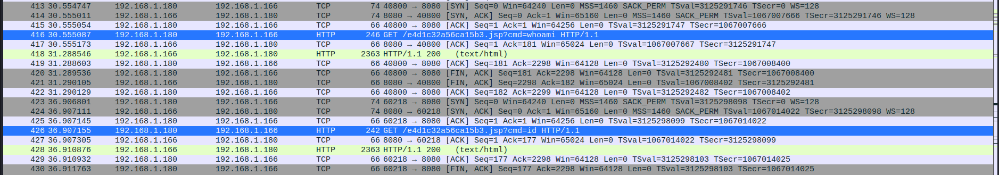
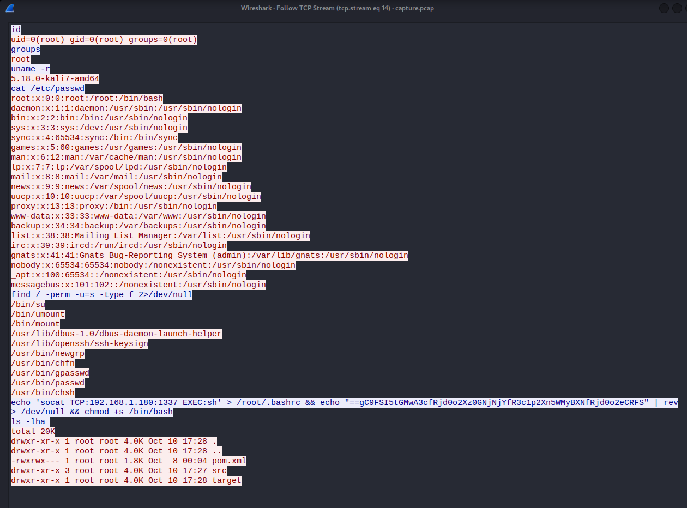

# Wrong Spooky Season
Esse write-up será sobre sobre o desafio Wrong Spooky Season do CTF Hack The Boo feito pelo Hack the Box para o Halloween.

## Sobre

Nesse desafio havia um arquivo zip para ser baixado que possuia apenas um arquivo de captura de tráfego (.pcap). O tráfego capturado é composto principalmente por coneções com uma aplicação web.

## Resolução

Olhando os pacotes 416 e 426, representados na Imagem 01, é possível ver que o usuário da aplicação foi capaz de obter um RCE (Execução remota de código) através do parâmetro cmd.

 **Imagem 01 - RCE na aplicação**

Então um pouco mais a frente, no pacote 464, o usuário utiliza o RCE para obter uma Shell reversa. E analizando o trafego gerado por essa conexão encontra-se um texto que foi jogado no /dev/null utilizando o comando echo, como pode ser visto na Imagem 02.

 **Imagem 02 - Comandos na Shell reversa**

Com o cyberchef é possível inverter e decodificar de Base64 para encontrar a flag.

 **Imagem 03 - Obtenção da flag**

  
---
Lucas Tomio Darim
