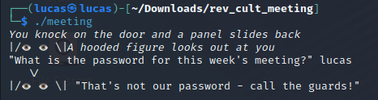
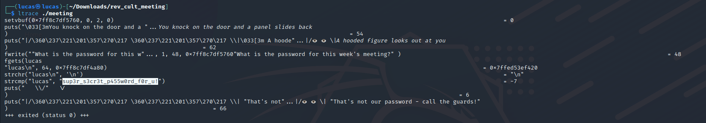
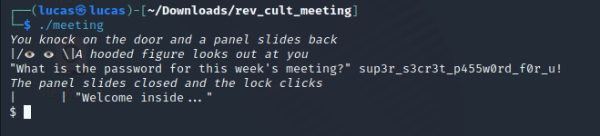

# Cult Meeting
Esse write-up será sobre sobre o desafio Cult Meeting do CTF Hack The Boo feito pelo Hack the Box para o Halloween.

## Sobre

Nesse desafio havia um arquivo zip para ser baixado e um docker que poderia ser ligado. O zip possuia apenas um executável (ELF) e no docker estava sendo executado esse mesmo programa, para se conectar bastava utilizar o netcat.

O programa ao ser executado imprimia uma mensagem requisitando por uma senha e aguardava o usuário inserí-la, como pode ser visto na Imagem 01. Se não fosse inserido a senha certa o programa imprimia uma mensagem e era interrompido.

**Imagem 01 - Execução do programa** 

## Resolução

Para identificar a senha utiliza-se o comando ltrace que intercepta e imprime todas as chamadas a bibliotecas feitas por um executável. Observando a Imagem 02, podemos ver que o programa lê a entrada do usuário utilizando a função fgets e depois chama a função strcmp para comparar a entrada com uma string. Essa string é a senha que deve ser digitada.

**Imagem 02 - ltrace**

Então ao executar o programa novamente mas dessa vez inserindo a senha correta é invocada uma shell, demonstrado na Imagem 03. Porém o programa está rodando local, então teremos apenas uma shell na nossa própria máquina. 

**Imagem 03 - Senha correta**

Então durante o CTF, era necessário se conectar com o servidor do Hack the Box na máquina que foi gerada através do netcat. Apoś estar conectado, bastava inserir a senha para obter uma shell, então com o cat era possível imprimir a flag que estava no mesmo diretório. 

---
Lucas Tomio Darim
