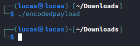
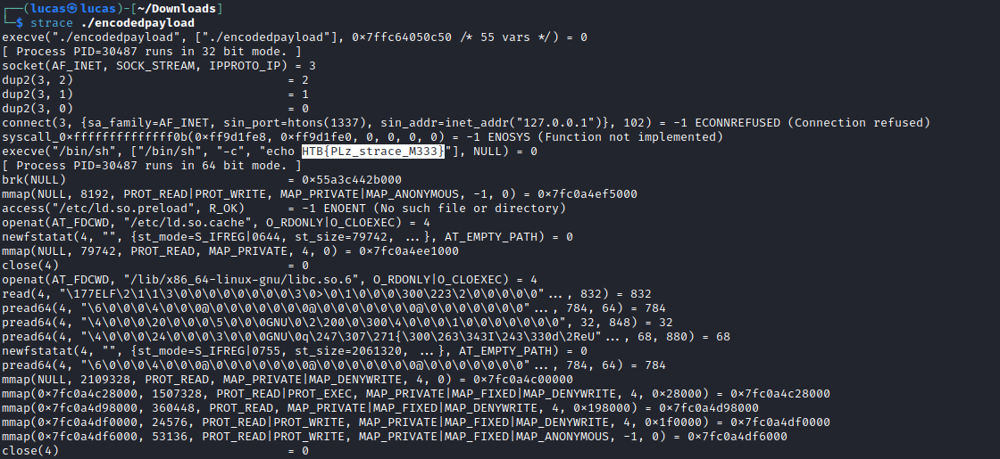

# Encoded Payload
Esse write-up será sobre sobre o desafio Encoded Payload do CTF Hack The Boo feito pelo Hack the Box para o Halloween.

## Sobre

Nesse desafio havia apenas um arquivo zip para ser baixado, contendo um executável (ELF). Esse programa vem sem permissão de excussão então deve-se usar "chmod +x encodedpayload" para que possa ser rodado. Ao ser executado esse programa não faz nada, como pode ser visto na Imagem 01. 

 **Imagem 01 - Execução do programa** 

## Resolução

Para achar a flag basta utilizar o comando strace que intercepta e imprime todas as chamadas de sistema (syscalls) feitas por um executável. Na Imagem 02 está uma parte da saída do strace e logo no início já é possível ver a flag. 

 **Imagem 02 - Execução do strace**

 
---
Lucas Tomio Darim
