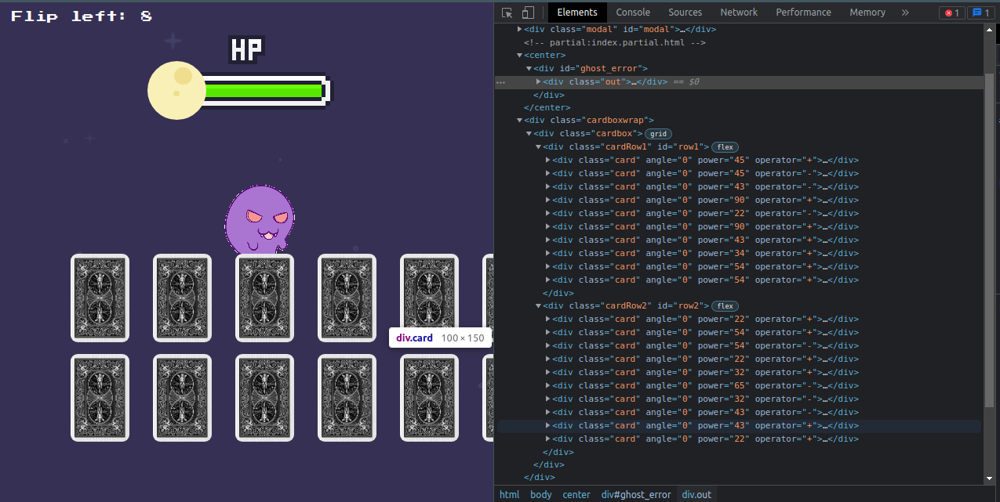
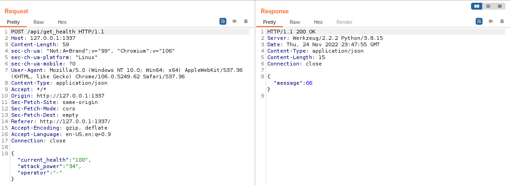

# Evaluation Deck
Esse write-up será sobre sobre o desafio Evaluation Deck do CTF Hack The Boo feito pelo Hack the Box para o Halloween.

## Sobre

Nesse desafio havia um docker que poderia ser ligado que rodava ma aplicação web e um arquivo zip para ser baixado. 
Na aplicação web havia 20 cartas com as faces escondidas e um fantasma que possuia uma barra de vida, ao ser escolhida uma carta poderia causar dano ou curar o fantasma. Sendo que o objetivo era zerar matar o fantasma e tinha o limite de virar 8 cartas.


<br>**Imagem 01 - Interface da aplicação**

Ao olhar inspecionar os elementos da página é possível descobrir o poder que cada carta possui e se ela cura ou causa dano. As cartas com operador "+" aumentam a vida do fantasma, enquanto as com o operador "-"diminuem.


<br>**Imagem 02 - Poder das cartas no menu inspecionar**

O zip continha todos os arquivos da aplicação, um dockerfile e umscript para que a aplicação pudesse ser rodada localmente.

## Resolução

Ao olhar o arquivo routes.py da aplicação é possível encontrar o seguinte código. Neste código é utilizada uma string formada a partir da vida atual do fantasma somada ou subtraido o poder da carta dependendo do operador para gerar a vida restante. A função compile, então, transforma essa string em código que é executado utilizando a função exec.

```python
    try:
        code = compile(f'result = {int(current_health)} {operator} {int(attack_power)}', '<string>', 'exec')
        exec(code, result)
        return response(result.get('result'))
```
Com o BurpSuite então é possível interceptar a requisição e alterar os paramentos de vida atual, poder de ataque e operador. 


<br>**Imagem 03 - Requisição interceptada**

Com a alteração dos parâmetros na requisição pode-se executar qualquer código python no programa, dessa forma temos um Remote Code Execution (RCE).


<br>**Imagem 04 - Injeção de código na requisição**

Logo utilizando a função open para abrir o arquivo com a flag e read para lê-lo obten-se a flag. Mas como estou rodando a aplicação localmente a flag é falsa para teste.


<br>**Imagem 05 - Obtenção da flag**

Durante o CTF era preciso fazer a mesma coisa mas contra o docker rodando no servidor do HTB, então a flag que retornava era HTB{j4v4_5pr1ng_just_b3c4m3_j4v4_sp00ky!!}.

<br>
---
Lucas Tomio Darim
