# Agile

Agile é uma máquina Linux de dificuldade média, sendo a primeira máquina da Open Beta Season.

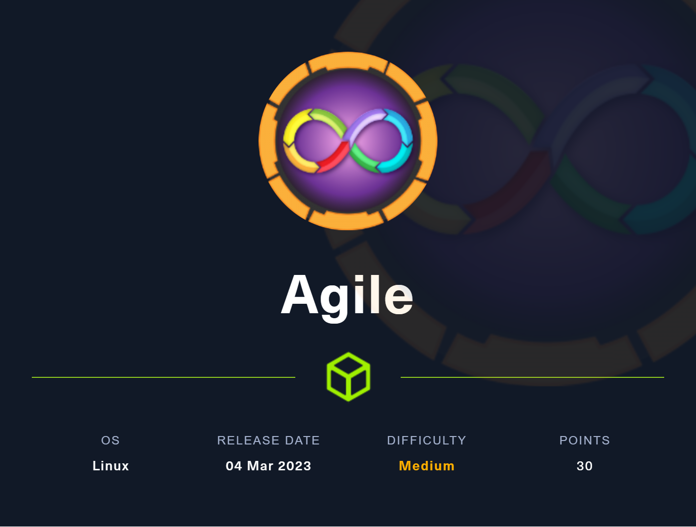

---

Começando escaneando as portas com o nmap para encontrar quais estão abertas. Foram encontradas apenas a 22 de SSH e 80 com um servidor web.

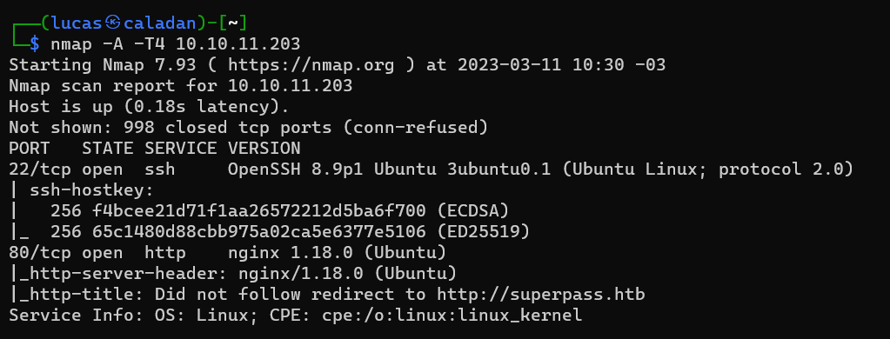

Ao fazer uma requisição a aplicação web, ocorre um redirecionamento para superpass.htb. Assim, sendo necessário adicionar este endereço ao "/etc/hosts".

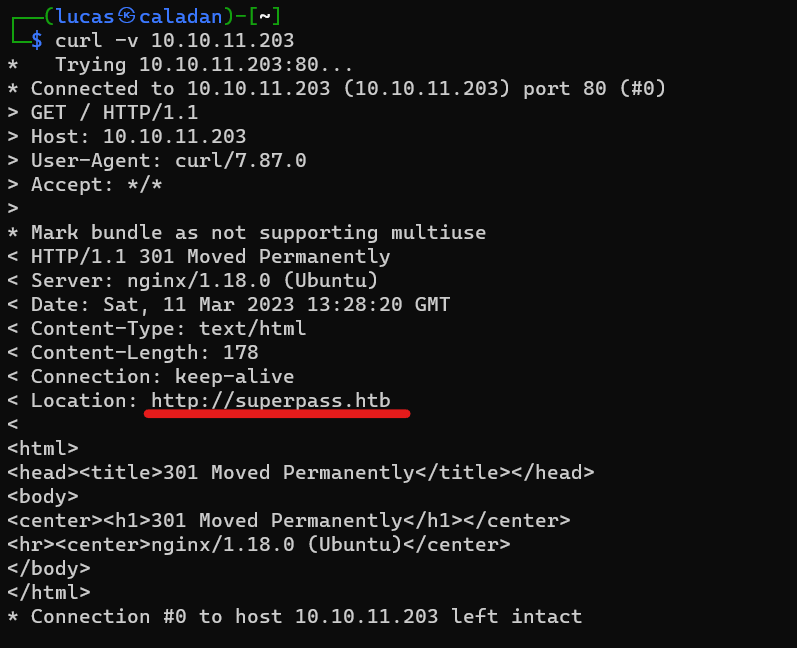

Acessando a aplicação web encontra-se um gerenciador de senhas. Quando logado, é possível adicionar novas senhas ao cofre e exportá-lo.

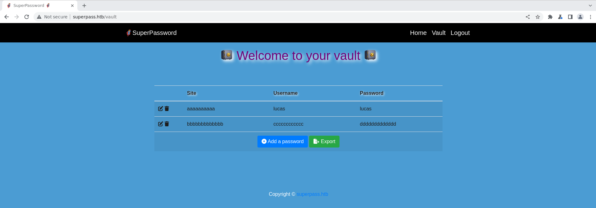

A opção de exportar faz o download das senhas adicionadas como um arquivo csv. Inspecionando a requisição com o Burp pode-se ver que é requisitado o /download passando um parâmetro fn com o nome do arquivo. 

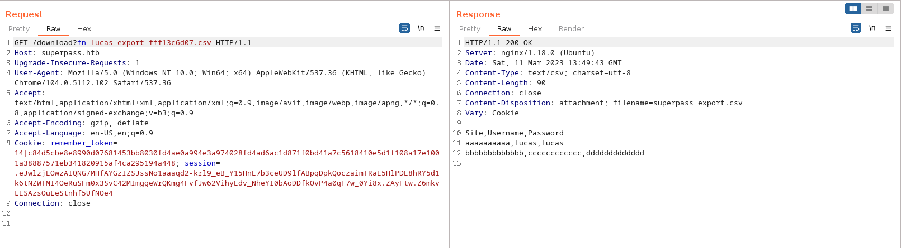

Ao alterar o argumento com o nome do arquivo podemos acessar outros arquivos presentes na máquina, assim obtemos um Local File Inclusion (LFI).


Ao passar como argumento um arquivo que não exista na máquina é retornado uma página de erro contendo o caminho para alguns arquivos em python, sendo um deles o vault_view.py que contém o código-fonte das views da aplicação.

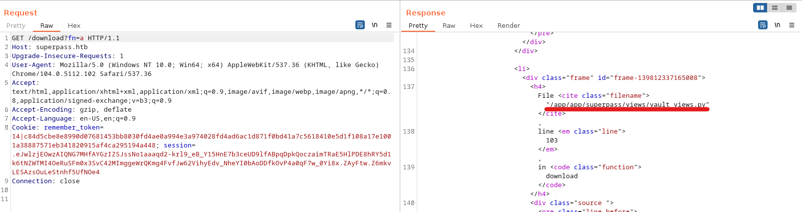

No código, podemos encontrar um Insecure Direct Object Reference (IDOR), onde alterando o valor de id é retornado os logins e senhas salvos por outros usuários.

```python
@blueprint.get('/vault/row/<id>')
@response(template_file='vault/partials/password_row.html')
@login_required
def get_row(id):
    password = password_service.get_password_by_id(id, current_user.id)

    return {"p": password}
```

Após algumas tentativas de id, o valor 8 retorna um login e senha do SSH da máquina, corum:5db7caa1d13cc37c9fc2.

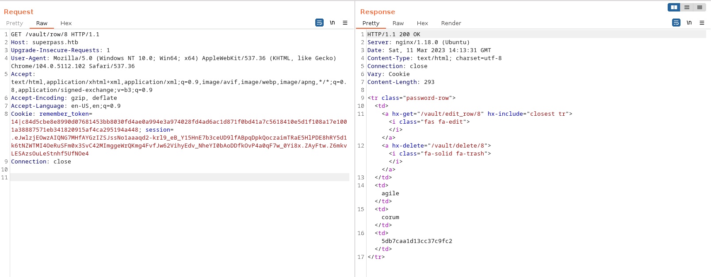

Com essas credenciais podemos acessar a máquina e já obter o user.txt.

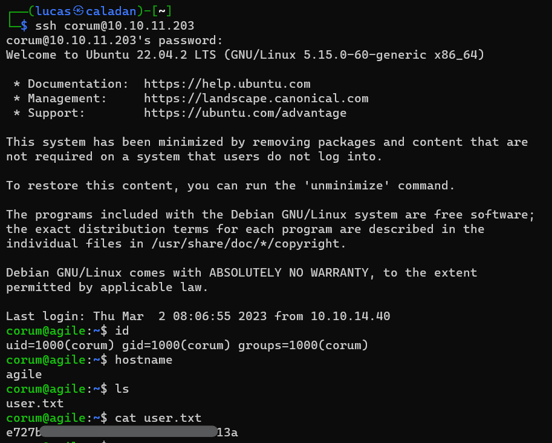

Agora com acesso de usuário podemos executar o linpeas.sh para obter mais informações sobre a máquina e possíveis formas de Privilege Escalation. Dessa forma encontramos que está sendo executado o Chrome com depurador na porta 41829.

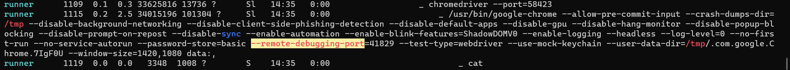

Para conseguir acessar o que está sendo executado nessa porta precisaremos fazer um Port Forwarding.

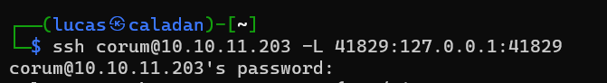

Então adicionamos o host e a porta no chrome://inspect.

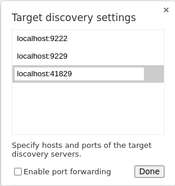

Com isso aparece o vhost test.superpass.htb, que podemos visualizar clicando em "inspect".

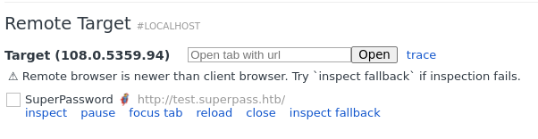

Ao inspecionar e ir para o vault encontra-se duas senhas do usuário edwards, onde a primeira é a do SSH nessa máquina. edwards:d07867c6267dcb5df0af

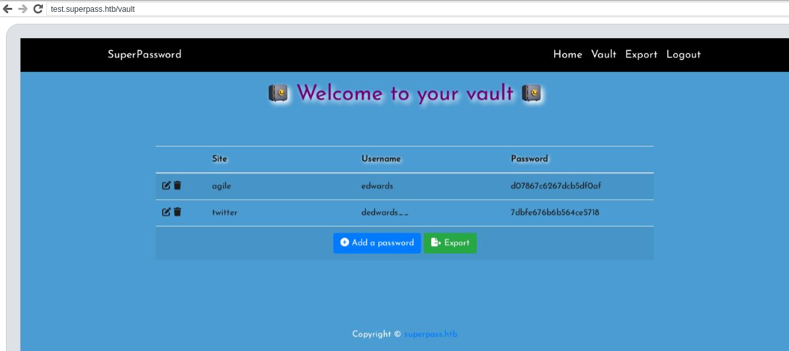

Pelo sudo, esse usuário pode executar o comando sudoedit como usuário e grupo dev_admin para editar os arquivos config_test.json e creds.txt. Porém, por causa da vulnerabilidade CVE-2023-22809, também é possível alterar outros arquivos. 

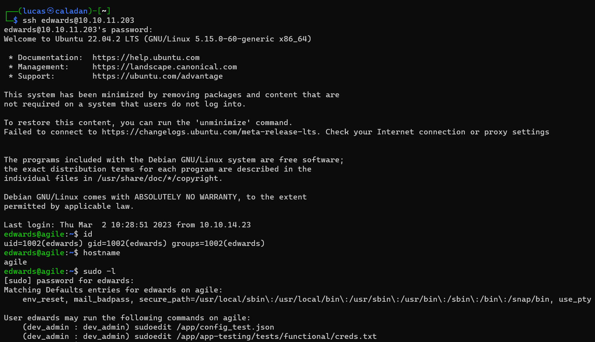

Com o comando "ps aux", encontramos que o root está executando source no arquivo "/app/venv/bin/activate". O source é um utilitário que lê e executa os comandos que estão escritos em um arquivo. 

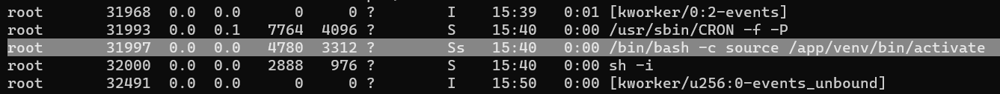

O arquivo "activate" pertence ao usuário root e ao  grupo dev_admin. Então podemos utilizar o exploit mencionado anteriormente para alterá-lo, possibilitando a execução de código como root.

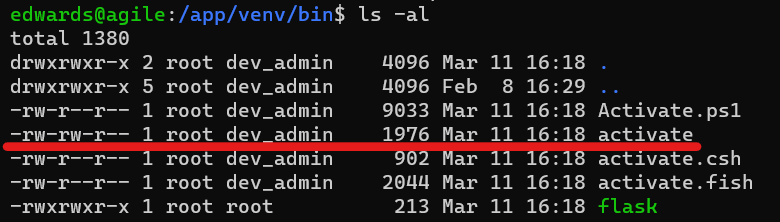

Para alterar esse arquivo executaremos o sudo com qualquer um dos dois arquivos que podemos editar, mas com a variável de ambiente EDITOR definida como "vim -- /app/venv/bin/activate". Isso abrirá tanto o arquivo que podemos como o activate para editar com o vim.

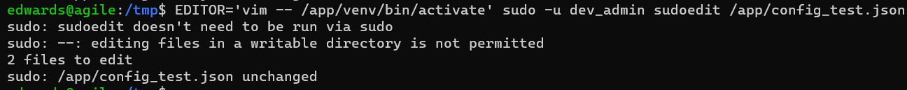

Adicionei ao activate uma reverse shell.


Obtemos a reverse shell que foi adicionada a activate. Agora possuímos  privilégio de root, então podemos acessar o root.txt.

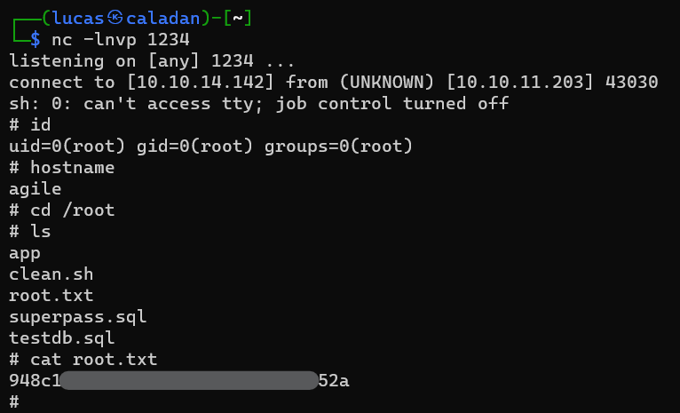

<br>

---
Lucas Tomio Darim