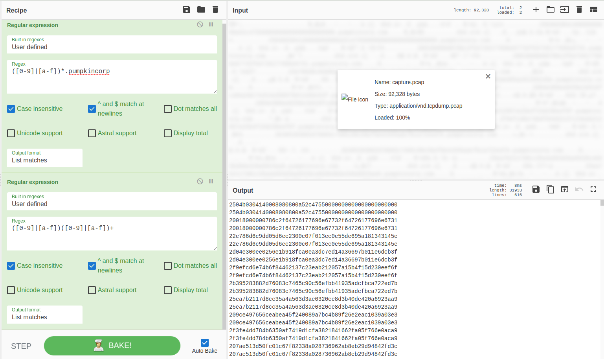

# Trick or Breach
Esse write-up será sobre sobre o desafio Trick or breach do CTF Hack The Boo feito pelo Hack the Box para o Halloween.

## Sobre

Nesse desafio havia um arquivo zip para ser baixado que possuia apenas um arquivo de captura de tráfego (.pcap). O tráfego capturado é composto por requisições e respostas DNS, sobre um subdomínios do domíno pumpkincorp[.]com. 

 **Imagem 01 - Querys DNS no arquivo de captura** 

## Resolução

Os números que estão como subdomínios são o hexadecimal de um arquivo que está sendo exfiltrado através do DNS. Então para resolver esse desafio e conseguir a flag precisa-se recuperar o arquivo exfiltrado.

Para separar os hexadecimais referente ao arquivo que se deseja do resto do arquivo de captura, eu utilizei o cyberchef. Primeiro filtrei pelos hexadecimais seguidos pelo domínio e depois apenas os hexadecimais como pode ser visto na Imagem 02. Assim, pude obter todos os subdomínios mas estão repetidos pois estão tanto nas requisições como nas respostas do DNS e também todos possuem um número 2 adicional no início. 

 **Imagem 02 - Subdomínios do arquivo de captura**

Para remover as linhas repetidas e o 2 do início de todas, fiz um pequeno programa em python que imprime todas as linhas pares a partir do segundo caractere. Esse programa pode ser visto na Imagem 3 e acessado por esse link: https://onlinegdb.com/hrBscVMTH

 **Imagem 03 - Sanitização dos subdomínios obtidos**

Com o resultado do programa anterior, utilizei novamente o cybechef mas agora para remover os espaços em branco e converter o arquivo para binário, que resultou em um arquizo PKZIP.

 **Imagem 04 - Sanitização dos subdomínios obtidos**

Com o arquivo obtido anteriormente baixado, é possível descompactar para obter os arquivos que estavam sendo exfiltrados. Por fim, utilizando o comando grep busquei por qual arquivo possuia a frase "HTB" e utilizei o grep mais uma vez para receber apenas a linha do arquivo com a flag, como mostrado na Imagem 05.

 **Imagem 05 - Obtenção da flag**

  
---
Lucas Tomio Darim
