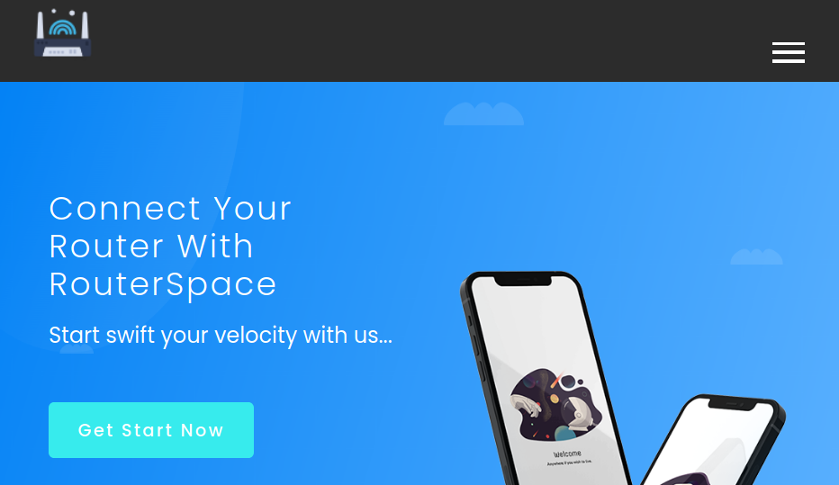

# [OK] - Router Space

| Difficult: | Easy |
| --- | --- |
| OS: | Linux |
| Last edit: | 05/07/22 |

Portas abertas no host:

- SSH na porta 22
- HTTP server na porta 80

Como não temos acesso a credenciais de SSH, o mais interessante agora é voltar a atenção para o serviço HTTP e aplicação Web.

```jsx
nmap -T5 -sV -sC 10.10.11.148
PORT   STATE SERVICE VERSION
22/tcp open  ssh     (protocol 2.0)
80/tcp open  http
```

A captura de tela abaixo apresenta a página inicial da aplicação **http web** na porta 80. Acessível por meio do navegador web browser. Com a verificação visual do código-fonte da aplicação não é possível notar a princípio nenhum parâmetro escondido ou que possamos fazer uso no momento.



A pagina acessa o subdiretório ***/img*** para carregar as imagens da aplicação. Tal diretório é protegido para paginação. A aplicação disponibiliza o download de um aplicativo Android em [**http://10.10.11.148/RouterSpace.apk**](http://10.10.11.148/RouterSpace.apk)

Foi realizado a tentativa de um escaneamento automatizado de páginas e diretórios disponíveis na aplicação utilizando a ferramenta ***gobuster,*** porém a aplicação web notou o escaneamento e bloqueou o procedimento retornando a mensagem **`Suspicious activity detected !!! {RequestID: 0 M oXQ6At 9 ni 3a }`.**


A verificação de *Headers* ****das requisições **http** pode ser uma possivel abordagem utilizada pela aplicação para bloquear o acesso da ferramenta ***gobuster***. Desta forma tentaremos inserir manualmente cabeçalhos validos nas requisições, a fim de burlar esta checagem.

Encontrei como inserir *Headers* manualmente no link abaixo:

[Gobuster Guide and examples](https://sohvaxus.github.io/content/gobuster.html)

```bash
gobuster dir -u 10.10.11.148 -w directory-list-2.3-medium.txt --delay 9000ms -H 'User-Agent: Mozilla/5.0 (X11; Linux x86_64; rv:78.0) Gecko/20100101 Firefox/78.0' -H 'Accept: text/html,application/xhtml+xml,application/xml;q=0.9,image/webp,*/*;q=0.8' -H 'Accept-Language: en-US,en;q=0.5' -H 'Connection: keep-alive' -H 'Upgrade-Insecure-Requests: 1' -H 'If-Modified-Since: Mon, 22 Nov 2021 11:33:57 GMT' -H 'If-None-Match: W/"652c-17d476c9285"' --wildcard
```

Mesmo apos a inserção dos *Headers* nas requisições do **gobuster** a ferramenta segue retornando a mesma mensagem de bloqueio. 

Ok, voltemos a atenção agora para o aplicativo Android **RouterSpace.apk** disponibilizado pela aplicação. Vamos tentar executar o aplicativo e verificar o funcionamento. E conectar o aplicativo ao proxy **BurbSuite** para podermos ver as chamadas de API.

Foi utilizado o emulador **Anbox** para executar o aplicativo. Tive algumas dificuldades na instalação do **Anbox** no meu ambiente **Kali Linux** então optei por fazer uma VM *Ubuntu desktop 18.04-LTS* e instalar o **Anbox** e **Burp Suite** para analisar o aplicativo. E assim foi feito…

Após ambiente preparado estabeleci o proxy com o Burp usando o **adb**:

`adb shell settings put global http_proxy <ip-my-vm>:<port-proxy>`

[Android device: set Wifi Proxy with ADB command](https://andresand.medium.com/android-device-set-wifi-proxy-with-adb-command-7a2f8cf4c434)

Interceptando ao clicar em Check Status no APP acontece uma Request POST enviando um endereço de IP. Notei no Request que a aplicação usa o **nome do Host: routerspace.htb**, portanto vinculei este nome ao endereço IP da machine em meu arquivo `/etc/hosts` afim de ter uma boa comunicação.


O comportamento das requisições podem ser visualizados abaixo. A resposta do Request é o mesmo endereço IP enviado. Isso me deixa pensativo, será que este endereço IP esta sendo usado como entrada para uma aplicação como um Ping ou algo parecido?!… 


Quando manipulei o Request passando como IP a string `“ | id “` notei que houve a execução do comando e que o usuário da aplicação é o Paul.


Sabendo disto foi fácil encontrar a flag de usuário com o payload: `"| cat /home/paul/user.txt”`

Vamos agora obter um Shell para ter mais interatividade no máquina. Para isso existem duas estratégias referente a SSH. Ou colocamos nossa chave pública de SSH no alvo, ou copiamos a chave privada do alvo para nossa máquina e acessamos via SSH.

A segunda opção parece mais fácil, portanto foi copiado a chave privada e iniciada a conexão SSH com o alvo no usuário Paul. Executando o PEASS no alvo, foi identificado que uma versão de `sudo 1.8.31` vulnerável com o **CVE-2021-3156.**

[https://github.com/carlospolop/PEASS-ng](https://github.com/carlospolop/PEASS-ng)

Com esta informação uma boa escolha é investir em um exploit e tentar explorar esta falha. Foi usado o exploit abaixo:

[https://github.com/CptGibbon/CVE-2021-3156](https://github.com/CptGibbon/CVE-2021-3156)

Ao executar o exploit obtemos o root, e em sequência obtemos acesso à chave `root.txt`

Fim…