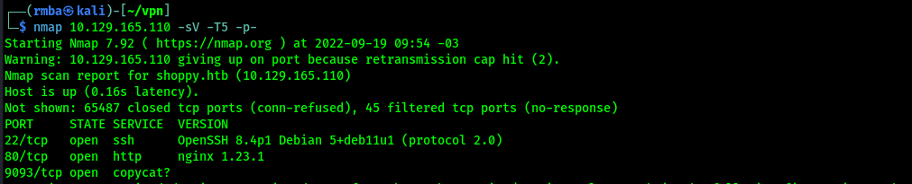
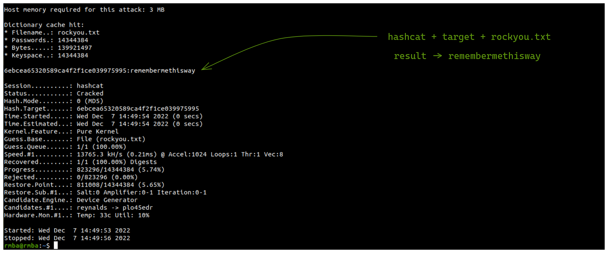

# [OK] - Shoppy

---

| Difficult: | Easy |
| --- | --- |
| OS: | Linux |
| Last edit: | 03/10/21 |

### # Port Scan

We received an IP address and, the first step here is enumerating and document everything that we find. Was mapping the addresses IP received with name *shoppy.htb* in hosts file on Linux.  Let’s start with a port scan on IP address.



```bash
rmba@rmba:~$ nmap -T5 -A -p- 10.10.11.180
Starting Nmap 7.80 ( https://nmap.org ) at 2022-12-07 14:30 -03
Warning: 10.10.11.180 giving up on port because retransmission cap hit (2).
Nmap scan report for shoppy.htb (10.10.11.180)
Host is up (0.20s latency).
Not shown: 65035 closed ports, 497 filtered ports
PORT     STATE SERVICE  VERSION
22/tcp   open  ssh      OpenSSH 8.4p1 Debian 5+deb11u1 (protocol 2.0)
80/tcp   open  http     nginx 1.23.1
|_http-server-header: nginx/1.23.1
|_http-title:             Shoppy Wait Page        
9093/tcp open  copycat?
| fingerprint-strings: 
|   GenericLines: 
|     HTTP/1.1 400 Bad Request
|     Content-Type: text/plain; charset=utf-8
|     Connection: close
|     Request
|   GetRequest: 
|     HTTP/1.0 200 OK
|     Content-Type: text/plain; version=0.0.4; charset=utf-8
|     Date: Wed, 07 Dec 2022 17:43:28 GMT
```

With the image above, the Nmap show 3 services enabled: 

- *Port 22 : OpenSSH v8.4p1*
- *Port 80 : Nginx v1.23.1*
- *Port 9093 : Copycat*

### # Directory FUZZ

Let’s do some tests with subdirectory using FFUF  tool. As show at below image, was found some subdirectories. For us, the most important now is the login and admin. The others subdirectories only are available when logged on application.

```bash
ffuf -u http://shoppy.htb/FUFF -w wordlists/directory-list-2.3-small.txt:FUFF
```


### # Sub Domain FUZZ (Using VHOST Discovery)

Let’s do some tests with subdomain using FFUF  tool. Here we are using the parameter VHOST to FFUF to find subdomains without DNS records. 


[Fuzz Faster with FFUF](https://medium.com/quiknapp/fuzz-faster-with-ffuf-c18c031fc480)

The *mattermost* subdomain was found as shown in the image below. Then we will add this subdomain to the Linux hosts file *mattermost.shoppy.htb*.


[](http://mattermost.shoppy.htb/login)


Accessing the application using web browser, we can see a counter down as showed in the image below and only it. A brief interpretation above the application allows us to understand that it is a counter for launching an application. So, the question is… Can we get access to application before the launching? 


With a list of subdomain founded, let’s work with the login page, as showed below.  

[](http://shoppy.htb/login)


With SQLi payload `admin' || '1'=='1`, the application bypass login and show an administration panel, with some products **announced** in Shoppy App.


On the panel, using the button “Search for users” it is possible to look for users in application. So, let's try to look for user admin. The application returned the password from user admin, but as a hash string, as showed: 

User Admin:

`[{"_id":"62db0e93d6d6a999a66ee67a","username":"admin","password":"23c6877d9e2b564ef8b32c3a23de27b2"}`

`{"_id":"62db0e93d6d6a999a66ee67b","username":"josh","password":"6ebcea65320589ca4f2f1ce039975995"}]`

When I think of break hash, I remember of the tool Hahcat  for Linux. Then come use this tool to break this hash using the common password wordlist password rockyou.txt.

**6ebcea65320589ca4f2f1ce039975995 ⇒ remembermethisway**



Using the found credentials we will try to login to the platform:


Let's try SSH access with the credentials, and get the user flag.


The user jaeger can execute the following command as root:


To run correctly you need the master password, but we don't have it. Let's check if the password is in the source code.


Now running with the master password, the executable shows us the credentials of the deploy user.


**Username:** deploy

**Password:** Deploying@pp!

In the conversations collected on the collaborative platform, we identified that the development machine has permissions to run docker.

Following this path we noticed that the deploy user is in the same user group as the docker, which allows the mounting of privileged directories inside the container.

For example, in this case we mount the directory / on the container's /mnt. This is possible because it is docker, which has root permissions, that does the actual mounting.

[docker | GTFOBins](https://gtfobins.github.io/gtfobins/docker/)


********Tks!********

********by:******** rmba
