# Capture The Flag - Menina de CyberSec  
### Segundo CTF de OSINT - Servidor Menina de CyberSec :dancer:
 
CTF (Capture The Flag) realizado entre os dias 29 e 31 de Outubro, no servidor Menina de CyberSec.
 
 
Agradecimentos especiais para a Sabrina, idealizadora do servidor e do CTF em questão.  
Instagram: @meninadecybersec
  

** Todos os desafios estão na pasta /pics 

# 2º CTF de OSINT - Menina de CyberSec

### Resumo
Este CTF aborda conceitos como OSINT, Esteganografia e Geolicalização.   Ideal para todos que desejam aprender sobre diferentes técnicas de Information Gathering, que são fundamentais nas stacks de um profissional de segurança cibernética.
  
## Foothold 
 
Para começar, acessamos o link (já expirado) para encontrar a página inicial do CTF, onde encontramos os desafios.
  

# Desafios

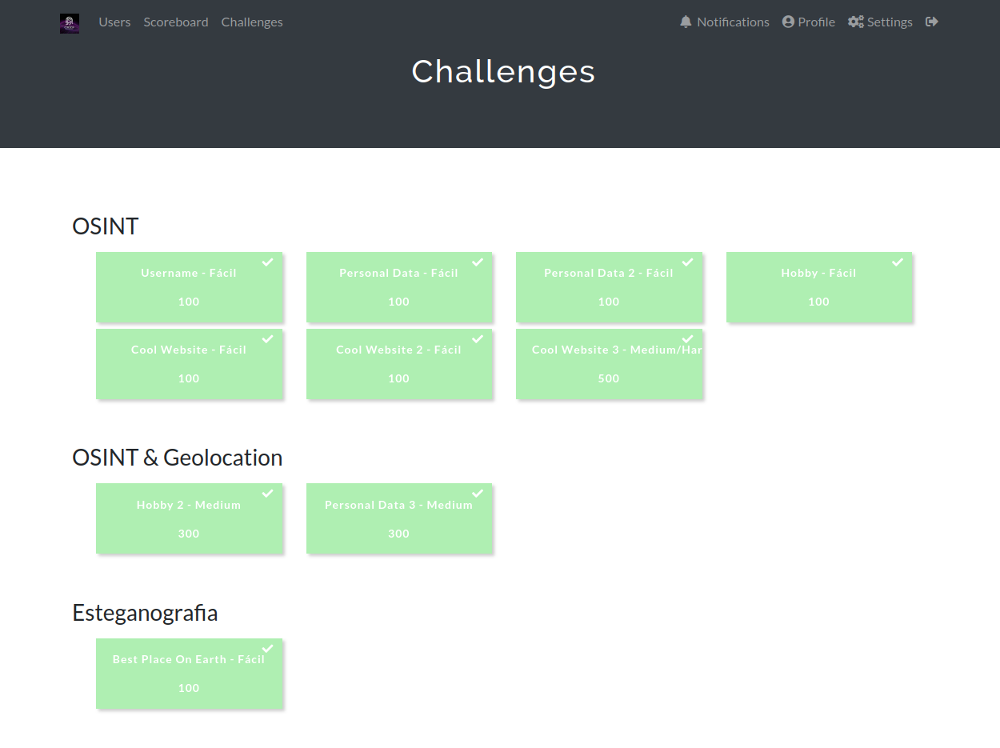 

O primeiro desafio a ser completado é o de esteganografia, pois nele temos uma imagem disponibilizada que será nosso ponto de partida.
  

## Desafio: Best Place on Earth - Fácil
    Quem tirou essa foto?
    
### Imagem em anexo:

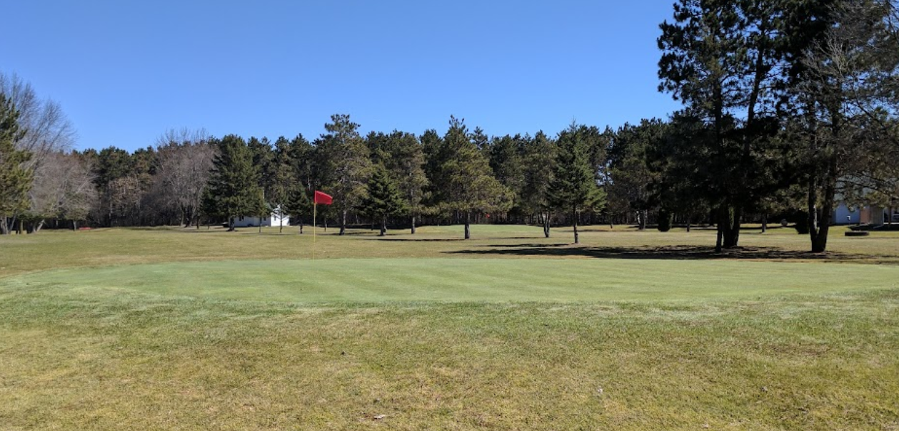 
  

### Metados interessantes dentro da imagem

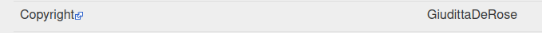 

Utilizando a ferramenta exif.tools nota-se um nome, um tanto quanto único, dentro dos metadados desta imagem.   Nossa abordagem será procurar por este nome em redes sociais para obter maiores informações.   Por se tratar de um CTF, é muito provável que o perfil seja novo e de certa forma, genérico. 
  
Flag Best Place on Earth - Esteganografia: MCS{GiudittaDeRose}

  

## Desafio: Username - Fácil

    Qual o nome de usuário encontrado?
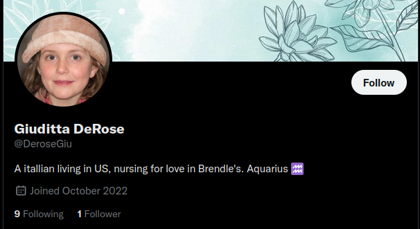 

Podemos observar, conforme dito anteriormente, que temos um perfil novo e com o nome que encontramos na imagem, também é possível notar no feed do perfil que a pessoa em questão gosta de jogar golf.   O que faz conexão com a imagem anexada no primeiro desafio.

Flag Username - OSINT: MCS{DeroseGiu}
  

## Desafio: Personal Data - Fácil
    Qual a profissão desse usuário?

Analisando o feed e a bio do Twitter "Nursing for love" (Enfermagem por amor) podemos concluir que a profissão do alvo é enfermagem.

Flag Personal Data - OSINT: MCS{enfermeira} ou MCS{nurse}

  

## Desafio: Personal Data 2 - Fácil
    De qual país esse usuário é?

Analisando a bio do perfil no Twitter, também notamos que o alvo é nascido na Itália, porém está morando nos Estados Unidos.

Flag Personal Data 2 - OSINT: MCS{United States}

  

## Desafio: Hobby - Fácil
    Qual o hobby preferido desse usuário?

Ao analisar o feed, bem como a imagem em anexo ao primeiro desafio, notamos que o hobby do alvo é Golf.

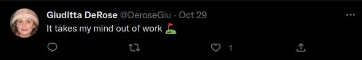 

Flag Hobby - OSINT: MCS{golf}

  

## Desafio: Cool Website - Fácil
    Qual website foi encontrado durante sua busca?

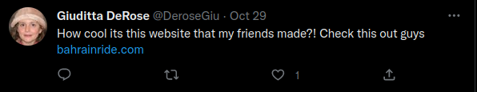 
 

Flag Cool Website - OSINT: MCS{www.bahrainride.com}

  

## Desafio: Cool Website 2 - Fácil
    Esse site está em funcionamento?

Ao tentar conectar no website, notamos que este está fora do ar, o que seria nossa resposta para esta flag.

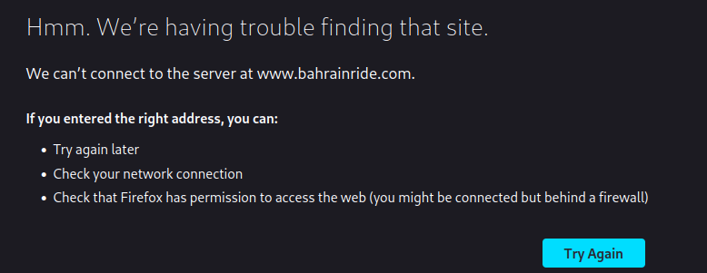 

Flag Cool Website 2 - OSINT: MCS{não}

  

## Desafio: Cool Website 3 - Hard
    Qual o título em destaque nesse website?

Nosso próximo desafio "Cool Website 3" nos pergunta sobre um título em destaque do site, porém este está fora do ar. 
Podemos então tentar acessar o site Wayback Machine (archive.org) para tentar resgatar versões antigas deste website.  
No Wayback Machine, encontramos uma versão do site de Fevereiro de 2011, com o seguinte título. 

  
### Print do Wayback Machine:
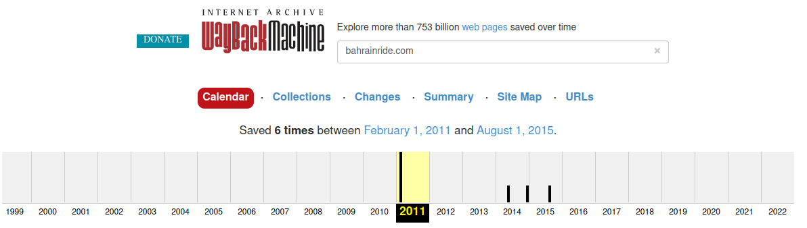 
  
### Print da versão de 2011 do WebSite bahrainride.com
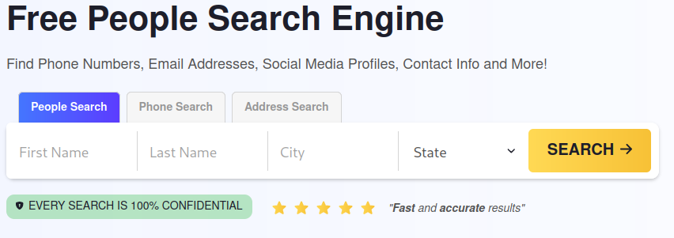 

Flag Cool Website 3 - OSINT: MCS{free people search engine}

  

## Desafio: Hobby 2 - Medium

    Qual o nome do local em que esse usuário pratica seu hobby?

Analisando novamente a seguinte imagem:

De forma simples, podemos pesquisar por esta imagem em sites de busca, evitando a necessidade de buscar por campos de golf na região do alvo.
 
O website duplichecker.com busca por imagens em diferentes fontes na internet, fazendo o upload de uma foto, ele busca em vários sites e algoritmos diferentes de busca por imagens similares.
  
Selecionando o Bing, obtemos a localização do campo de golf já no primeiro resultado.

### Resultado bing:

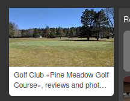

Flag Hobby 2 - OSINT & Geolocation: MCS{pine meadow golf course}

  

## Desafio: Personal Data 3 - Medium

    Qual o nome da rua em que esse usuário mora ?

Neste desafio podemos acessar a localização do clube de golf através do google maps, e tentar obter mais informações.

 

Acessando o Twitter do alvo, temos um post muito interessante.

## Print do post:

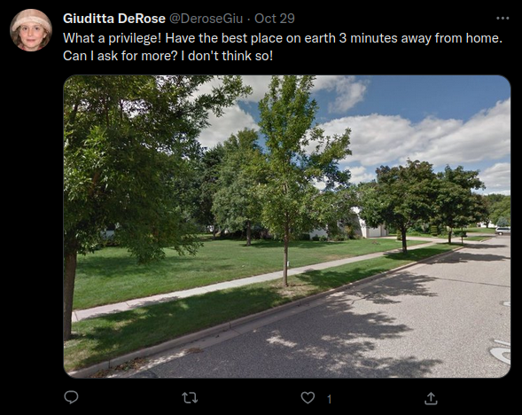
  
"Que privilégio, tenho o melhor lugar do mundo á 03 minutos de distância de casa. Posso pedir mais que isso? Acho que não!"
  
Concluímos que o alvo mora próximo ao campo de golf, onde ela pratica seu hobby favorito.
 
Utilizando o google maps para investir as ruas próximas ao campo de golf, encontramos a seguinte rua.
  
## Print da rua encontrada:

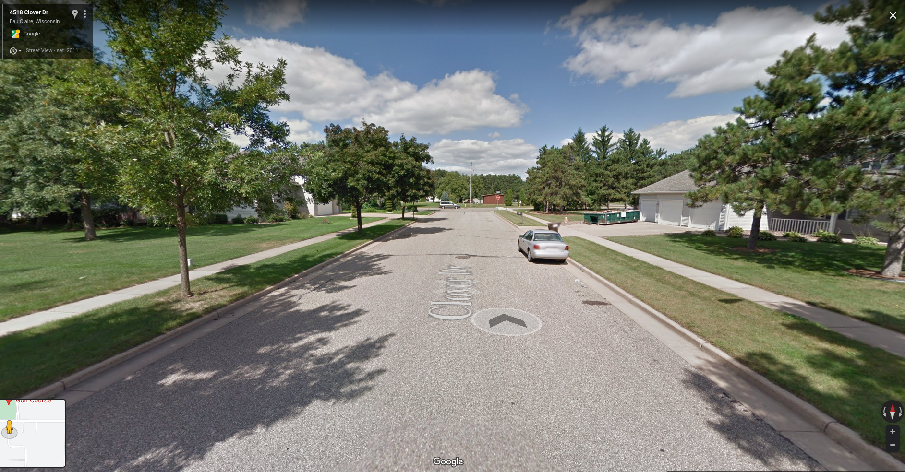
  
EUREKA! Exatamente a mesma rua do post do alvo! Clover Dr.
  
Flag Personal Data 3 - OSINT & Geolocation: MCS{cloverdr}

   

# Agradecimentos

Novamente, agradecemos a Sabrina por criar este CTF e também a todos que auxiliaram neste processo.  

 
