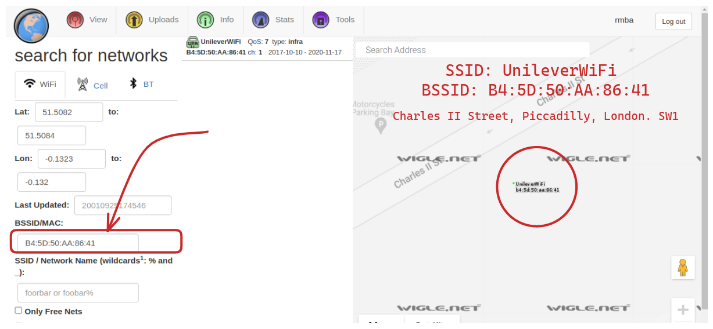

# OhSINT

.jpg)

```bash
rmba@rmba:~$ exiftool Downloads/WindowsXP.jpg 
ExifTool Version Number         : 12.40
File Name                       : WindowsXP.jpg
Directory                       : Downloads
File Size                       : 229 KiB
File Modification Date/Time     : 2022:12:16 17:37:22-03:00
File Access Date/Time           : 2022:12:16 17:37:27-03:00
File Inode Change Date/Time     : 2022:12:16 17:37:22-03:00
File Permissions                : -rw-rw-r--
File Type                       : JPEG
File Type Extension             : jpg
MIME Type                       : image/jpeg
XMP Toolkit                     : Image::ExifTool 11.27
GPS Latitude                    : 54 deg 17' 41.27" N
GPS Longitude                   : 2 deg 15' 1.33" W
Copyright                       : OWoodflint
Image Width                     : 1920
Image Height                    : 1080
Encoding Process                : Baseline DCT, Huffman coding
Bits Per Sample                 : 8
Color Components                : 3
Y Cb Cr Sub Sampling            : YCbCr4:2:0 (2 2)
Image Size                      : 1920x1080
Megapixels                      : 2.1
GPS Latitude Ref                : North
GPS Longitude Ref               : West
GPS Position                    : 54 deg 17' 41.27" N, 2 deg 15' 1.33" W
```

# 1 - What is this users avatar of?

Buscando por OWoodflint no Google encontramos a rede social abaixo. O perfil tem um gato como avatar.

[JavaScript is not available.](https://twitter.com/owoodflint?lang=en)

# 2 - What city is this person in?


Buscando por como encontrar  a geolocalização de WIFI pelo BSSID encontrei o [https://wigle.net](https://wigle.net/) que é uma aplicação voluntaria que os usuários podem compartilhar a geolocalização exata de APs no globo.

Fiz uma conta na aplicação e busquei pelo BSSID disponível, resultando em:

**SSID:** UnileverWiFi 

**BSSID:** B4:5D:50:AA:86:41

**GEO:** Charles II Street, Piccadilly, London. SW1



# 3 - Whats the SSID of the WAP he connected to?

Informação colhida anteriormente:

**SSID:** UnileverWiFi 

# 4 - What is his personal email address?

Buscando pelo username OWoodflint é possivel encontrar um projeto no github que consta o endereço de email.

**Email:** [OWoodflint@gmail.com](mailto:OWoodflint@gmail.com)


# 5 - What site did you find his email address on?

Informação colhida anteriormente:

**Site:** github

# 6 - Where has he gone on holiday?

[Uncategorized - Oliver Woodflint Blog](https://oliverwoodflint.wordpress.com/category/uncategorised/)


**City:** New York

# 7 - What is this persons password?


Password: pennYDr0pper.!
